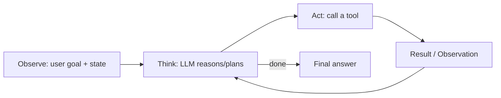

# Agentic AI Dev Roadmap — Everything to Cover

_A single-page map of what to learn to go deep on Agentic AI + LLM internals. Revised after reviewing **all six** docs in this folder — you have more real ground than a typical "learner" profile:_

| Doc | What it proves you've already done |
|---|---|
| [AI_ASSISTANT_DEEP_DIVE.md](./AI_ASSISTANT_DEEP_DIVE.md) | Full agent loop (Ollama + Copilot providers), MCP two-phase plan/execute safety, chat identity/session design, auth trust-boundary analysis |
| [RAG_COMPLETE_GUIDE.md](./Notes/RAG_COMPLETE_GUIDE.md) | Embeddings, pooling, chunking trade-offs, vector search mechanics |
| [MCP_ASSISTANT_REDESIGN_PLAN.md](./MCP_ASSISTANT_REDESIGN_PLAN.md) | Threat modeling an agentic system (prompt injection, credential exposure, missing authZ) *before* building |
| [ASYNC_STREAMING_GUIDE.md](./ASYNC_STREAMING_GUIDE.md) | Async generators, `for await`, event loop, SSE token streaming, worker threads |
| [IMPROVEMENT_GUIDE.md](./IMPROVEMENT_GUIDE.md) | Re-ranking, embedding model trade-offs, prompt templates, caching, process-pool architecture |
| [SCALING_HLD.md](./SCALING_HLD.md) | Tier-by-tier scaling design (10K → 1B users): sharding, GPU embedding services, multi-region, event-driven pipelines |

This means you're not starting a curriculum from zero — you're **filling in the theory under practice you already have**. The checklist below is organized so we can go topic-by-topic in later sessions.

---

## How to read this

- ✅ = you've already built/used this in FlowForge — just needs deepening
- 🟡 = adjacent, partly touched
- ⬜ = new ground

---

## 1. LLM Internals (the "how it actually works" layer)

| Topic | Status | Why it matters |
|---|---|---|
| Tokenization (BPE, vocab, special tokens) | ⬜ | Explains context limits, cost, weird truncation bugs |
| Transformer architecture (attention, Q/K/V, multi-head, positional encoding) | ⬜ | Root cause of why LLMs behave the way they do (context, hallucination, recency bias) |
| Embeddings deep dive (pooling, dims, similarity) | ✅ | Already covered in your RAG doc — good foundation |
| Autoregressive decoding & sampling (temperature, top-k, top-p, repetition penalty) | ⬜ | Controls determinism/creativity of agent outputs |
| Context window mechanics (KV cache, why long context is slow/expensive) | ⬜ | Explains agent loop cost blow-up with long histories |
| Training stages: pretraining → SFT → RLHF/DPO → instruction tuning | ⬜ | Explains *why* a model follows instructions or refuses things |
| Quantization & inference optimization (GGUF, batching, speculative decoding) | 🟡 (using Ollama) | Needed if you self-host models like your `llama3`/`mistral` |
| Model families & when to use which (GPT/Claude/Llama/Mistral/Qwen, reasoning models like o1-style) | 🟡 | Model selection is an agent-design decision, not just a config |

---

## 2. Prompting & Context Engineering

| Topic | Status |
|---|---|
| System prompt design (role, constraints, output contracts) | 🟡 |
| Few-shot / in-context learning | ⬜ |
| Chain-of-Thought, self-consistency | ⬜ |
| Structured output (JSON mode, function-calling schemas, grammars) | ✅ (MCP tool schemas) |
| Context window budgeting (what to keep/drop/summarize as history grows) | 🟡 |
| Prompt injection & why untrusted text is dangerous in context | ✅ (you already designed around this in MCP plan) |

---

## 3. What Makes a System "Agentic" (core mental model)

An LLM call is **not** an agent. It becomes agentic when you add a **loop**:

| Topic | Status |
|---|---|
| Reasoning loop patterns: ReAct (reason+act), Plan-and-Execute, Reflexion (self-critique) | ✅ ReAct via your `agentLoop.js`; ⬜ others |
| Autonomy levels (single tool call → bounded loop → fully autonomous long-running agent) | 🟡 |
| Stopping conditions / loop termination (max steps, budget, confidence) | 🟡 |
| Human-in-the-loop / confirmation gates (your "confirmed action" pattern) | ✅ |

---

## 4. Tool Use & Function Calling

| Topic | Status |
|---|---|
| Tool schema design (clear names, strict param types, minimal surface) | ✅ |
| Tool selection reasoning (how the model decides *which* tool) | 🟡 |
| Parallel vs sequential tool calls | ⬜ |
| Error handling & retries when a tool call fails or returns bad data | 🟡 |
| MCP (Model Context Protocol) — spec, transport, resources vs tools vs prompts | ✅ (you built an MCP server) |
| Emerging agent-to-agent protocols (A2A, OpenAI Agents SDK handoffs) | ⬜ |

---

## 5. Memory Systems

| Topic | Status |
|---|---|
| Working memory (current conversation/context window) | ✅ |
| Short-term episodic memory (recent turns, Redis-backed history) | ✅ |
| Long-term semantic memory (vector store retrieval) | ✅ |
| Memory write policy — what gets remembered, when, and how it's summarized/compacted | ⬜ |
| Memory conflicts / forgetting / staleness | ⬜ |

---

## 6. Planning & Task Decomposition

| Topic | Status |
|---|---|
| Single-step vs multi-step task planning | 🟡 |
| Explicit plan objects (checklist/plan-and-execute, re-planning on failure) | 🟡 (your "Plan & Context" rail concept) |
| Tree of Thought / multi-path exploration | ⬜ |
| Task graphs / DAG-based agent workflows (e.g., LangGraph-style state machines) | ⬜ |

---

## 7. Multi-Agent Systems

| Topic | Status |
|---|---|
| Orchestrator–worker pattern (a router LLM dispatching to specialist agents) | 🟡 (your `intentRouter.js` is a simpler, deterministic version) |
| Peer-to-peer / debate patterns | ⬜ |
| Hierarchical agents (manager agent supervising sub-agents) | ⬜ |
| Shared state / blackboard patterns vs message-passing | ⬜ |
| When multi-agent is *worse* than one well-prompted agent (overhead, cost, failure modes) | ⬜ |

---

## 8. Evaluation, Observability & Reliability

| Topic | Status |
|---|---|
| Tracing agent runs (spans per LLM call / tool call, latency, token cost) | 🟡 (planned as Jaeger/OpenTelemetry at Tier 3 in your `SCALING_HLD.md`, not yet implemented) |
| LLM-as-judge evaluation, golden datasets, regression testing prompts | ⬜ |
| Hallucination detection & grounding checks (did the answer actually come from context?) | ✅ (system prompt forbids inventing facts; SELECT-only SQL guard; "answer only from context" prompt template) |
| Guardrails (input validation, output filtering, refusal handling) | 🟡 (write rate limiting + allowlists exist; no input/output content filtering yet) |
| Cost/latency/token accounting per request | ⬜ (noted as needed for LLM routing/quotas at scale, not built) |

---

## 9. Security for Agentic Systems (you're ahead here)

| Topic | Status |
|---|---|
| Prompt injection via untrusted retrieved content | ✅ (explicit mitigation in your MCP plan) |
| Least-privilege tool design (explicit allow-listed tools, no "run arbitrary SQL") | ✅ |
| Secrets handling (never round-tripping credentials through the LLM) | ✅ |
| AuthZ / per-user scoping of agent actions | ✅ (you documented this as a known gap) |
| Sandboxing code-executing agents (if you ever let an agent run code) | ⬜ |
| Audit logging & accountability for autonomous actions | 🟡 |

---

## 10. Retrieval & Vector Search (deepen beyond current RAG)

| Topic | Status |
|---|---|
| Chunking strategies (fixed-size vs sentence/paragraph/recursive/semantic) | 🟡 (fixed-size shipped; sentence-aware/recursive designed in `IMPROVEMENT_GUIDE.md` §1, not switched over) |
| Embedding model trade-offs (MiniLM vs mpnet/bge vs OpenAI dims/cost/quality) | 🟡 (compared in `IMPROVEMENT_GUIDE.md` §2, still on MiniLM-384) |
| Hybrid search (BM25/keyword + vector) | ⬜ |
| Reranking (cross-encoders) after initial vector search | 🟡 (designed with `ms-marco-MiniLM` cross-encoder in `IMPROVEMENT_GUIDE.md` §6, not wired in) |
| Score thresholds / HNSW tuning for precision at scale | 🟡 (documented, not applied) |
| Query rewriting / HyDE / multi-query retrieval | ⬜ |
| Metadata filtering (per-file, per-page, per-kind payload filters) | ✅ (`kind`/`resourceId` payload indexes; per-user Qdrant scoping) |
| Structured-data RAG (rows → natural-language docs, as in your redesign plan) | ✅ |

---

## 11. Frameworks & Ecosystem (know the landscape, pick deliberately)

| Framework | What it's for |
|---|---|
| LangChain / LangGraph | Composable chains + graph-based stateful agents |
| LlamaIndex | Retrieval-focused indexing/query pipelines |
| AutoGen / CrewAI | Multi-agent orchestration |
| OpenAI Agents SDK / Assistants API | Managed agent runtime + handoffs |
| Semantic Kernel | .NET/enterprise agent orchestration |
| MCP (Anthropic) | Standard tool/resource protocol — you're already using this |
| Raw hand-rolled loop (your `agentLoop.js`) | Full control, no framework lock-in — good for learning internals first |

**Learning order suggestion:** understand your own hand-rolled loop deeply first (you already have this) → then compare against LangGraph to see what a framework abstracts away.

---

## 12. Production Concerns

| Topic | Status |
|---|---|
| Streaming responses (SSE/websockets), non-blocking via async generators | ✅ (deep understanding shown in `ASYNC_STREAMING_GUIDE.md` — event loop, `for await`, backpressure-free token yielding) |
| Model routing & fallback (local Ollama vs cloud, retry on failure) | ✅ |
| Process/worker isolation for CPU-bound work (ONNX embedding off the main event loop) | ✅ (`process-pool.js` — documented in `IMPROVEMENT_GUIDE.md` §13) |
| Rate limiting & backpressure | 🟡 (write-tool rate limiting exists; no HTTP-level `express-rate-limit`/Nginx limiting yet) |
| Caching (embedding cache, prompt cache, semantic cache) | 🟡 (query-embedding Redis cache designed in `IMPROVEMENT_GUIDE.md` §10, not implemented; model warm-up on boot also just proposed) |
| Versioning prompts/tools safely (rollout, A/B, rollback) | ⬜ |
| Auth, secrets hygiene, CORS lockdown, file validation | 🟡 (gaps explicitly catalogued in `IMPROVEMENT_GUIDE.md` §11 and `AI_ASSISTANT_DEEP_DIVE.md` §7b — known, not yet fixed) |

---

## 13. Systems Design for Scaling AI Services

This is the part most "agentic AI dev" tutorials skip entirely, and you already have a full tier-by-tier design for it in `SCALING_HLD.md`.

| Topic | Status |
|---|---|
| Single-machine baseline bottlenecks (event-loop saturation, single Qdrant/Redis, no durability) | ✅ |
| Horizontal scaling (PM2/K8s, load balancer, health checks) | 🟡 (designed as Tier 0/1, not deployed) |
| Per-user data isolation strategies: N collections vs 1 shared collection + payload filter | ✅ (you identified the "100K collections is bad" problem and the filter-based fix) |
| Job queues for async processing (Bull/BullMQ → Kafka/SQS as volume grows) | 🟡 (designed, not built) |
| Dedicated GPU-backed embedding services (HF TEI/vLLM) vs local ONNX-in-request | 🟡 (designed for Tier 1-2) |
| Sharding strategies (hash(userId) % N) for vector DB + relational DB | 🟡 (designed for Tier 3) |
| Multi-region deployment, read replicas, geo-routing | ⬜ (Tier 2+ design only) |
| LLM routing/circuit-breaker across providers, token-budget-aware failover | ⬜ (Tier 3 design only) |
| Cost modeling (per-request $ cost across compute/LLM/vector DB as usage scales) | 🟡 (`SCALING_HLD.md` has a cost model section) |

**Why this matters for "becoming an AI dev":** most people learn to build a demo agent; very few can reason about what breaks first when 10K real users hit it. You've already done that reasoning exercise once — worth revisiting as a recurring skill, not a one-off doc.

---

## 14. Node.js Runtime Internals for AI Serving

Agentic systems live or die on how well you handle concurrent, long-running, streaming LLM calls — this is JS-runtime knowledge, not AI knowledge, but it's load-bearing.

| Topic | Status |
|---|---|
| Event loop model (single-threaded, non-blocking I/O) and why streaming doesn't block other users | ✅ |
| `async function*` / `for await...of` — async generators for token-by-token streaming | ✅ |
| Async iterables beyond generators (Node Readable streams, custom `Symbol.asyncIterator`) | ✅ |
| `yield` vs `yield*` delegation across provider-specific stream adapters | ✅ |
| Worker threads / process pools for CPU-bound work (embeddings) without blocking the event loop | ✅ |
| Backpressure handling on writable streams (SSE `res.write` return value, `drain` event) | ⬜ |
| Graceful request cancellation (AbortController wired through to the upstream LLM call) | ✅ |

---

## Suggested Learning Path (given where you already are)

1. **LLM internals** — tokenization → attention/transformer basics → sampling → training stages (the biggest pure-theory gap; everything else you've already touched practically)
2. **Agent loop patterns** — formalize ReAct/Reflexion/Plan-and-Execute against your existing `agentLoop.js`
3. **Close the documented-but-not-implemented gaps** — reranking, sentence-aware chunking, embedding cache, rate limiting (`IMPROVEMENT_GUIDE.md` already has the plan; this is fast, high-payoff practice)
4. **Evaluation & observability** — add tracing/eval to what you've already built
5. **Multi-agent patterns** — only after single-agent reliability is solid
6. **Framework survey** — LangGraph/CrewAI, compared against your hand-rolled version
7. **Systems design drills** — re-derive `SCALING_HLD.md`'s tiers from scratch without looking, for a different hypothetical system (tests whether the reasoning transfers)

---

_Next: pick a numbered section above and we'll go deep on it, one at a time._
