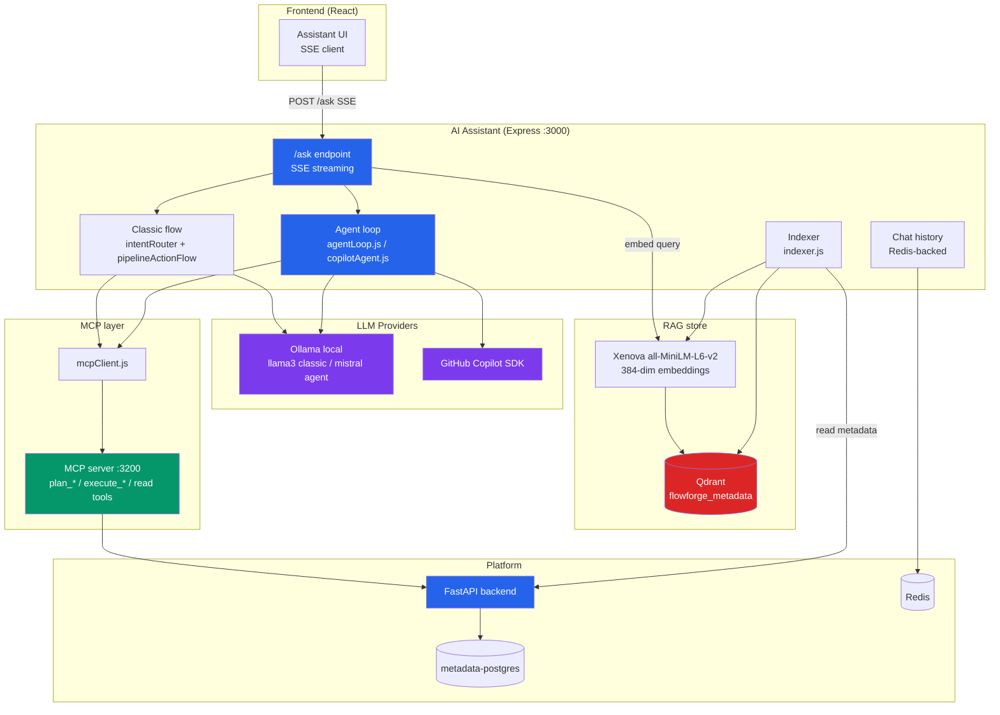
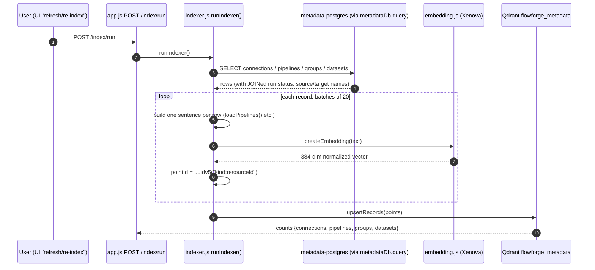
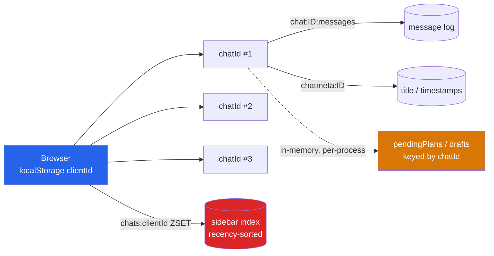
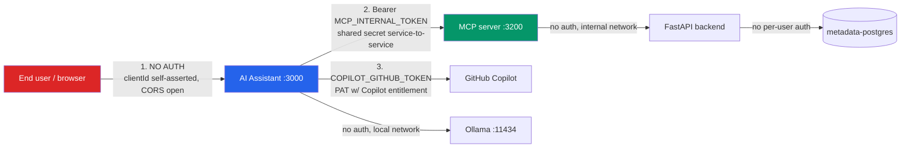

# FlowForge AI Assistant — Deep Dive

_In-depth implementation reference: HLD, RAG, MCP, the looping agent, integration, and worked flows._

**Grounded in code:** [app.js](../app.js), [services/agentLoop.js](../services/agentLoop.js), [services/copilotAgent.js](../services/copilotAgent.js), [services/indexer.js](../services/indexer.js), [services/vector.js](../services/vector.js), [services/embedding.js](../services/embedding.js), [services/llm.js](../services/llm.js), [services/intentRouter.js](../services/intentRouter.js), [services/pipelineActionFlow.js](../services/pipelineActionFlow.js), [services/mcpClient.js](../services/mcpClient.js), [mcp-server/index.js](../mcp-server/index.js).

---

## 1. High-Level Design

The assistant is a **Node/Express service** ([app.js](../app.js), port 3000) that never touches Postgres, Airflow, Trino, or Spark directly. It composes four subsystems: an SSE `/ask` endpoint, two answer engines (classic + agent), a RAG store, and an MCP layer.



### Two answer modes

Chosen per-request by the frontend's toggle (`agentMode`) and gated server-side by `AGENT_MODE_ENABLED`:

| Mode | How context/actions are obtained | Router |
|---|---|---|
| **Classic** (default) | Deterministic: regex intent detection → a fixed MCP `list_*` tool, OR conversational pipeline slot-filling, OR fallback RAG vector search | `intentRouter.js` + `pipelineActionFlow.js` |
| **Agent** (toggle on) | The **LLM itself** decides which MCP tools to call in a bounded tool-calling loop | `agentLoop.js` (Ollama) or `copilotAgent.js` (Copilot) |

Both share the **same write-safety guarantee**: only `plan_*` (dry-run) tools are ever exposed to the model; `execute_*` runs only after explicit human confirmation.

---

## 2. RAG subsystem — how metadata gets searchable

The "documents" here aren't files — they're **live platform metadata rows** turned into natural-language sentences.

### 2a. Indexing flow (user → refresh → DB → chunk/embed → vector DB)



Key implementation details:

- **"Chunking" = one record per resource.** No arbitrary text splitting. Each row becomes a single compact sentence. E.g. `loadPipelines()` emits: _"Pipeline "orders_bronze". Source: source_pg.sales. Target: iceberg.bronze.orders, write mode append. Schedule: @daily, enabled: true. Last run: success at ..."_ — built by JOINing pipelines with connections and a `LATERAL` subquery for the latest run.
- **Embedding model:** `Xenova/all-MiniLM-L6-v2` via `@xenova/transformers`, run **in-process** (no external embedding API), `pooling: "mean", normalize: true` → **384-dim** unit vector.
- **Idempotent upserts:** the Qdrant point ID is a **deterministic UUID v5** of `"${kind}:${resourceId}"` (`pointId()`), so re-indexing **updates in place** instead of duplicating. Safe to run repeatedly.
- **Collection:** single shared `flowforge_metadata`, cosine distance, with **payload indexes on `kind` and `resourceId`** (`ensureMetadataCollection()`) so retrieval can be filtered by kind and cleanup can target one resource (`deleteByResource`).
- **Resilience:** `vector.js` wraps every Qdrant call in `withRetry` (3 tries) for `ECONNRESET/ECONNREFUSED/ETIMEDOUT`, with a keep-alive HTTP agent (Windows/Docker idle-socket fix).

### 2b. Retrieval flow (classic mode fallback)

When classic mode can't route a question to an exact `list_*` tool, it does semantic search:

1. `createEmbedding(question)` → 384-dim query vector.
2. `searchMetadata(vector, { kind, limit: 5 })` → Qdrant `points/query`, optionally filtered by `kind`, `with_payload: true`.
3. Top-5 payloads are formatted as context lines: `- [pipeline] name: text` and injected into the prompt.

> **Why RAG is the _fallback_, not the primary:** `intentRouter.js` notes a small top-k mixed-kind search can silently under-return (e.g. "what connections do we have?" returning 3 of 4). So for clearly-scoped questions the assistant prefers the **authoritative complete list** via MCP over approximate vector search. RAG covers the open-ended/fuzzy questions.

---

## 3. MCP subsystem

- **Transport:** stateless Streamable HTTP. `mcpClient.js` opens a fresh client per call (`callMcpTool` / `listMcpTools`), authenticated with `Bearer MCP_INTERNAL_TOKEN`. The server ([mcp-server/index.js](../mcp-server/index.js)) rebuilds a fresh `McpServer` per `POST /mcp`.
- **Tool families:** read tools (`list_connections`, `list_pipelines`, `list_pipeline_runs`, `query_table`, `get_table_schema`, …) call backend `GET`s directly; write tools use the **two-phase plan/execute** pattern (`plan_*` previews with a 5-min TTL `plan_id`; `execute_*` consumes it one-shot).
- **Safety in the server:** `execute_*` handlers run `checkWriteRateLimit()` (per-hour cap) and `takePlan()` (one-shot, TTL-enforced). `query_table` enforces SELECT-only via `assertSelectOnly`.
- **Error surfacing:** when a tool handler throws, the MCP SDK returns `isError: true` with raw text; `callMcpTool` detects that and throws the real message instead of blindly `JSON.parse`-ing (so "404" doesn't masquerade as a JSON error).

See [create_dataset_flow.md](../../docs/create_dataset_flow.md) for a full worked plan→execute example (dataset provisioning), including how the model decides _which_ tool to call.

---

## 4. The looping agent

### 4a. Ollama loop — `runAgentLoop`

```mermaid
sequenceDiagram
    autonumber
    participant U as User
    participant APP as app.js /ask
    participant LOOP as agentLoop.runAgentLoop
    participant LLM as Ollama /api/chat (mistral, streaming)
    participant MCP as MCP server
    participant API as FastAPI

    U->>APP: POST /ask {agentMode:true, question, chatId, history}
    APP->>LOOP: runAgentLoop({clientId:chatId, question, history, onStage, onPlan})
    Note over LOOP: CONFIRM_RE / CANCEL_RE checked FIRST<br/>(handles a pending plan before any LLM call)
    LOOP->>MCP: listMcpTools() → filter to ALLOWED_TOOL_NAMES (+ ask_choice)
    loop up to MAX_ITERATIONS = 6
        LOOP->>LLM: chat(system + history + question + tools)
        LLM-->>LOOP: stream content deltas + final {tool_calls?}
        alt model chose tool_calls
            loop each tool call
                LOOP->>LOOP: allowlist guard
                alt ask_choice (local pseudo-tool)
                    LOOP-->>APP: onPlan({status:"picker"}) → stop turn
                else real MCP tool
                    LOOP->>MCP: callMcpTool(name, args)
                    MCP->>API: GET/POST
                    API-->>LOOP: JSON result
                    alt plan_* returned plan_id
                        LOOP->>LOOP: setPendingPlan(clientId, kind, plan_id)
                        LOOP-->>APP: onPlan({status:"preview", ...})
                    end
                end
                LOOP->>LOOP: push {role:"tool", content: result} into messages
            end
            Note over LOOP: continue → model reacts to results (next step)
        else model produced final text
            LOOP-->>U: stream tokens (final answer) → loop ends
        end
    end
```

Step-by-step:

1. **User → model.** `/ask` (agent mode) calls `runAgentLoop` with `clientId = chatId`, the question, and `history`. Messages = `[system prompt] + last 10 history turns + question`.
2. **Confirm-first shortcut.** Before any LLM call, if `CONFIRM_RE` matches and a pending plan exists, it calls `confirmPendingPlan()` → executes the stored plan → ends. (`CANCEL_RE` clears it.) This is the "next turn" continuation.
3. **Advertise tools.** `getToolDefs()` lists MCP tools, filters to `ALLOWED_TOOL_NAMES`, appends the local `ask_choice` pseudo-tool, and passes them to Ollama's `/api/chat` `tools` param.
4. **Model decides → looping agent executes.** The model streams content and may emit `tool_calls`. For each: allowlist guard → `callMcpTool` → MCP → **FastAPI service API call** → result pushed back as a `role:"tool"` message. Then `continue` — the model **sees the results and decides the next step**.
5. **Success / next steps loop** until the model emits a final text answer (no tool call), up to **`MAX_ITERATIONS = 6`** (prevents infinite loops — after 6 it returns "couldn't finish in a reasonable number of steps").
6. **Plan previews.** Any `plan_*` result with a `plan_id` triggers `setPendingPlan(clientId, kind, planId)` + `onPlan({status:"preview"})` → the UI renders a confirmation card. The `execute_*` for that plan is **never in `ALLOWED_TOOL_NAMES`** — only `confirmPendingPlan` (deterministic) can run it on the next turn.
7. **How it ends / user input again.** Turn ends when: final text streamed, OR `ask_choice`/menu/picker card emitted (waits for user click), OR a plan preview awaits Confirm. The user's next message re-enters `/ask` with the same `chatId`, and the confirm-first shortcut (step 2) resumes the pending action.

Robustness the loop handles: models that emit tool calls as raw JSON in `content` (`extractInlineToolCall`), Go-style `<nil>` instead of `null` (`sanitizeModelJson`), and degenerate "here are several tools, pick one" prose (`extractToolMenu` → picker card).

### 4b. Copilot loop — `runCopilotAgentLoop`

Same external contract, but the **Copilot SDK owns the loop internally**: you register real `defineTool()` handlers up front and `sendAndWait()` resolves only when the model has a final answer — so there's **no `MAX_ITERATIONS` for-loop here**. The safety-critical invariants are preserved by **reusing** `agentLoop.js`'s exports (`SYSTEM_PROMPT`, `ALLOWED_TOOL_NAMES`, `confirmPendingPlan`, `setPendingPlan`, `CONFIRM_RE`…) so behavior can't drift between providers. `onPermissionRequest: approveAll` is safe because only pre-vetted read/plan tools are ever registered (never `execute_*`).

Provider is a one-line swap in app.js: `AGENT_RUNNERS = { ollama: runAgentLoop, copilot: runCopilotAgentLoop }`, selected per-request via `provider` or the `AGENT_LLM_PROVIDER` default.

---

## 5. Classic mode's pipeline-creation flow

In classic mode there's no LLM tool-calling. `pipelineActionFlow.js` does **multi-turn slot-filling**: `CREATE_INTENT_RE` starts a `draft` (in-memory `Map`, 30-min TTL), the LLM helps gather fields conversationally, then it calls `plan_create_pipeline` → shows preview → `confirmPendingDraft()` calls `execute_create_pipeline`. Same two-phase safety, different (deterministic) router.

There's also `buildAnalysisContext()` for data questions: the LLM writes one SELECT → `query_table` (SELECT-only) → rows become context for the final answer (or an error explanation if the SQL fails — never hallucinated).

---

## 6. Chat history & context preservation

Redis-backed, **multiple conversations per browser** ([app.js](../app.js)):

```
chat:<chatId>:messages   LIST   the message log
chatmeta:<chatId>        HASH   { title, created_at, updated_at }
chats:<clientId>         ZSET   chatId → updated_at  (sidebar, recency-sorted)
```

- **Identity:** `clientId` = the browser (persistent, from `getClientId()`); `chatId` = one conversation (fresh UUID per "New chat"). The agent's pending-plan map is keyed by **`chatId`**, so a pending confirm in one chat can't be triggered from another chat in the same browser.
- **Persistence:** after each turn, `/ask` `rpush`es the user + assistant messages (including any `plan` card and `suggestions` so a refresh restores them), `ltrim`s to the last **200** messages, and `expire`s at **7 days** (refreshed each turn). First turn auto-titles the chat from the question; `updated_at` is bumped so the sidebar re-sorts.
- **Legacy migration:** old single-thread histories stored under `chat:<clientId>:messages` are lazily adopted as `chatId === clientId` with zero data movement (`listChatsForClient`).

**Context kept per turn** (two layers):

1. **Conversation context** — the frontend sends recent `history`; the loops use the **last 10 turns** (`slice(-10)`), and classic mode additionally drops turns older than **5 days**.
2. **Grounding context** — agent mode: live tool results in the message thread; classic mode: authoritative `list_*` results, analysis rows, or top-5 RAG hits. The system prompt forbids inventing facts ("state only facts returned by a tool call").

**Streaming & lifecycle:** answers stream token-by-token over **SSE** with `stage` events (`analyzing → searching → referencing → thinking → streaming`). If the client disconnects, `res.on("close")` fires an `AbortController` that **aborts the upstream LLM request** (stops token generation/cost) and skips persistence. Follow-up **suggestion pills** are generated after the first turn (best-effort, non-throwing).

---

## 7. Identity, context basis & authentication

### 7a. The two identifiers everything hinges on

Almost every stateful behavior keys off just **two client-supplied identifiers**. Neither is a security credential — they are correlation keys.

| Identifier | Origin | Scope | What it keys | Lifetime |
|---|---|---|---|---|
| **`clientId`** | Generated once in the browser (`getClientId()` in `frontend/src/api/assistant.ts`, persisted in `localStorage`) | One **browser** | The chat **index** ZSET `chats:<clientId>` (the sidebar's list of conversations) | Until localStorage is cleared |
| **`chatId`** | Fresh `crypto.randomUUID()` per **New chat** (`POST /chat/new`) | One **conversation** | Message log `chat:<chatId>:messages`, metadata `chatmeta:<chatId>`, **and the in-memory pending-plan/draft maps** | 7-day Redis TTL (refreshed each turn) |

**On what basis everything works — the keying rules:**

1. **A browser owns many conversations.** `clientId → many chatId` via the `chats:<clientId>` ZSET (scored by `updated_at`, so the sidebar is recency-sorted). One browser, one `clientId`, N conversations.
2. **Each turn is addressed by `chatId`.** `/ask` requires `chatId`; history read/append, auto-titling, and TTL refresh all operate on `chat:<chatId>:*`. `clientId` is only needed to keep the sidebar index in sync.
3. **Pending actions are scoped to `chatId`, not `clientId`.** `app.js` passes `clientId: chatId` into the agent loop, so `agentLoop.js`'s `pendingPlans` Map and `pipelineActionFlow.js`'s `drafts` Map are keyed by **conversation**. This is deliberate: a plan previewed in chat A **cannot** be confirmed from chat B in the same browser.
4. **RAG points are keyed independently** by `uuidv5("${kind}:${resourceId}")` — unrelated to client/chat identity, so re-indexing is idempotent regardless of who triggers it.



> **Durability asymmetry (important):** Redis-backed chat text/metadata **survives** a restart (7-day TTL); the pending-plan/draft Maps are **in-process memory** and are **wiped** on restart. So a container restart *between* a preview and its confirm loses the plan — the user sees "plan expired" / the confirm card appears stale, even though the chat history is intact.

### 7b. Authentication & trust boundaries

There are **three distinct trust relationships**, and only two of them are authenticated. Critically, the **end-user → assistant hop has no authentication at all** today.



| Hop | Auth mechanism | Notes |
|---|---|---|
| **User → AI Assistant** (`/ask`, `/chats`, `/chat/*`) | **None** | No login, no JWT, no session, no user model. `app.js` mounts only `cors()` + `express.json()` — no auth middleware. `clientId` is **self-asserted** by the client; anyone who knows/guesses a `clientId` can read that browser's chats. CORS is wide open for the dev frontend. |
| **AI Assistant → MCP server** | **`Bearer MCP_INTERNAL_TOKEN`** | Shared internal secret set in both services' env. `mcpClient.js` attaches `Authorization: Bearer <token>`; the MCP server's middleware rejects mismatches with 401. **If the token is empty, auth is skipped** — intended for local dev only; must be set in production. The MCP server is meant to be **internal-only** (not published on a host port). |
| **AI Assistant → GitHub Copilot** | **`COPILOT_GITHUB_TOKEN`** | A `github_pat_` token with an active Copilot entitlement; only used when the Copilot provider (`copilotAgent.js`) is selected. Authenticates the *service* to GitHub, not any end-user. |
| **AI Assistant → Ollama** | None | Local model endpoint on the trusted Docker/local network. |
| **MCP → FastAPI backend** | None | Internal network call; the backend itself has no per-user auth. |

**Audit identity:** because there is no end-user identity to propagate, every MCP write is audit-logged with a fixed actor `"ai-assistant"` (`audit()` in `mcp-server/index.js`). This is a **known gap**, explicitly called out in the code header — not a design choice to weaken later. See [MCP_ASSISTANT_REDESIGN_PLAN.md](MCP_ASSISTANT_REDESIGN_PLAN.md) §4 for the full threat analysis (prompt injection, credential exposure, missing authZ, network exposure).

**Defense-in-depth that exists despite no user auth:** write tools are gated behind two-phase plan/execute + human confirm; `execute_*` is never model-callable; secrets are stripped from any record summarized into the prompt (`SENSITIVE_KEY_RE`); analysis SQL is SELECT-only; and the MCP server is kept off any public port.

> **Roadmap:** per-user authentication (JWT/OIDC), real end-user identity propagated through the MCP audit trail, and RBAC on write tools. Tracked in [SCALING_HLD.md](SCALING_HLD.md) and [IMPROVEMENT_GUIDE.md](IMPROVEMENT_GUIDE.md).

---

## 8. Safety model (cross-cutting)

| Guarantee | Enforcement |
|---|---|
| Model can preview but not execute writes | `execute_*` excluded from `ALLOWED_TOOL_NAMES`; only `confirmPendingPlan`/`confirmPendingDraft` reach it |
| Button clicks unambiguous | `confirmAction: "confirm"/"cancel"` fast-path in `/ask` — handled with **no LLM/regex interpretation** |
| No double/stale execution | plans are one-shot + 5-min TTL (`takePlan`) |
| No runaway loops | `MAX_ITERATIONS = 6` (Ollama loop) |
| No secret leakage to LLM | `SENSITIVE_KEY_RE` strips credential-like fields from summarized records |
| SELECT-only analysis | `assertSelectOnly` (client) + backend guard |
| Write throttling | `checkWriteRateLimit()` per hour |

**Known limitations** (already noted in code): the pending-plan/draft `Map`s are **in-memory** — a container restart between preview and confirm drops them (the "plan expired / card reappears" behavior), while Redis chat text survives; and there's no per-user auth yet (actor is always `"ai-assistant"` in audit logs — see §7b).

---

## 9. Component / file map

| Concern | File |
|---|---|
| HTTP entry, SSE `/ask`, chat history, routing between modes | [app.js](../app.js) |
| Agent tool-calling loop (Ollama), safety allowlist, plan store | [services/agentLoop.js](../services/agentLoop.js) |
| Agent loop (GitHub Copilot SDK variant) | [services/copilotAgent.js](../services/copilotAgent.js) |
| Classic intent detection (regex → kind) | [services/intentRouter.js](../services/intentRouter.js) |
| Classic conversational pipeline creation (slot-filling) | [services/pipelineActionFlow.js](../services/pipelineActionFlow.js) |
| RAG indexer (metadata → sentences → embeddings → Qdrant) | [services/indexer.js](../services/indexer.js) |
| Embeddings (Xenova all-MiniLM-L6-v2, 384-dim) | [services/embedding.js](../services/embedding.js) |
| Qdrant client (collection, upsert, search, delete) | [services/vector.js](../services/vector.js) |
| LLM providers (Ollama generate + chat/tools stream) | [services/llm.js](../services/llm.js) |
| MCP client (stateless Streamable HTTP) | [services/mcpClient.js](../services/mcpClient.js) |
| MCP server (read + plan/execute tools) | [mcp-server/index.js](../mcp-server/index.js) |
| Follow-up suggestion pills | [services/suggestions.js](../services/suggestions.js) |
| Redis connection | [services/redis.js](../services/redis.js) |
| metadata-postgres query helper | [services/metadataDb.js](../services/metadataDb.js) |

Related deep dives: [RAG_COMPLETE_GUIDE.md](RAG_COMPLETE_GUIDE.md), [MCP_ASSISTANT_REDESIGN_PLAN.md](MCP_ASSISTANT_REDESIGN_PLAN.md), [SCALING_HLD.md](SCALING_HLD.md), [ASYNC_STREAMING_GUIDE.md](ASYNC_STREAMING_GUIDE.md).
