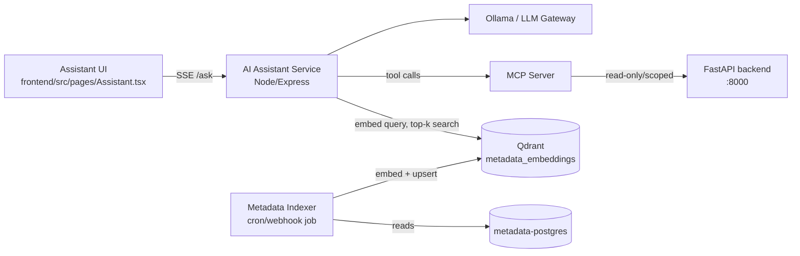

# FlowForge AI Assistant — Redesign Plan (Document RAG → Live Platform Assistant + MCP)

Status: **Proposal — not yet implemented.** No code has been removed or added yet; this document captures the review findings, target architecture, MCP security analysis, and phased plan agreed upon before implementation begins.

## 1. UI review — `ui_prompts/AI-Assistant/code.html` + `DESIGN.md`

Static Stitch-generated mockup (hardcoded example content, no JS wiring, no state) — matches the reference screenshot: dark sidebar shell (`Data Engine` nav: Catalog/Pipelines/Assistant/Datasets/Admin), a "Plan & Context" execution-plan rail, chat thread with inline SQL/confirm cards, quick-reply chips, composer. Tokens in `DESIGN.md` match the existing FlowForge Tailwind config (`primary #3525cd`, Hanken Grotesk/Inter/JetBrains Mono, 4px grid).

Conclusion: good visual target, nothing to fix in the mockup itself. It needs to become a real React page (`frontend/src/pages/Assistant.tsx`) wired to a real streaming backend instead of static markup.

## 2. `AI_Assistant` code review

Current state: a **document-upload RAG app** — chunked file upload (Redis-tracked) → process-pool worker → extract text (`pdf.js`: pdf/docx/xlsx/text) → clean+chunk (`chunk.js`) → local ONNX embed (`embedding.js`, MiniLM-384d) → store per-user Qdrant collection (`vector.js`) → `/ask` embeds the question, does a Qdrant cosine search, stuffs top-5 chunks into a prompt, streams from Ollama or a cloud LLM Gateway (`llm.js`).

### Keep / Remove

| Keep | Remove | Why |
|---|---|---|
| `services/embedding.js` | `services/pdf.js` | No more file-format text extraction — data source is structured metadata (Postgres rows), not uploaded PDFs/DOCX/XLSX |
| `services/vector.js` (repurposed) | `services/chunk.js` | Chunking is document-specific (char-based sliding window); metadata records will be embedded as whole structured records, not sliding-window text |
| `services/llm.js` | `services/process-pool.js` + `process-worker.js` | This pool exists solely to isolate the ONNX embedder from crashing the main process during big document uploads. With no user uploads, embedding runs as a scheduled/triggered sync job, not per-request — doesn't need process isolation at request time |
| `services/redis.js` (repurposed for session/conversation state) | Upload endpoints in `app.js` (`/upload/init`, `/upload/chunk`, `/upload/resume`, `/upload/status`, `/docs/*`) | No file uploads anymore |
| SSE streaming pattern in `/ask` | `uploads/` dir, chunked-upload logic in `upload.js` | Not needed |
| Qdrant + Redis containers | — | Still useful, repurposed (see below) |

Net effect: shrinks from a ~9-file document pipeline to three pieces: a **metadata indexer** (syncs metadata → Qdrant), a **retriever+chat** endpoint, and a new **MCP tool layer** for live actions/writes.

## 3. Target architecture

Two separate data paths — this is the most important design decision:

- **Retrieval path (read-only, RAG)**: an indexer job periodically (or via webhook on resource change) pulls rows from `metadata-postgres` — connections, `target_object_registry` (datasets), `pipelines`, `pipeline_groups`, recent Airflow run/task logs — turns each into a short natural-language "document", embeds it, and upserts into Qdrant. The `/ask` endpoint only ever *reads* Qdrant — no tool access, so it can't be tricked into writing anything.
- **Action path (MCP, read/write)**: a separate MCP server exposes a small, explicit set of tools (`create_connection`, `create_dataset`, `create_pipeline`, `create_pipeline_group`, `get_pipeline_status`, `list_datasets`, …) that call the existing FastAPI backend endpoints. Only the LLM turn actually executing a *confirmed* user action gets tool access — the retrieval/Q&A turn never does.

This separation is deliberate: don't give the same LLM call both "answer questions from indexed data" and "create real resources" capability at once — keeps a prompt-injected/malicious answer from triggering a create/delete tool call.

## 4. MCP server — security analysis (must precede implementation)

Highest-risk part of the plan: it gives an LLM the ability to mutate the platform (create pipelines, connections with credentials, trigger DAGs).

**a) Prompt injection → unauthorized actions.** Untrusted indexed text (pipeline descriptions, log lines) could contain injected instructions if it ever reaches a tool-enabled turn.
→ Mitigation: retrieval context is **never** passed to a model turn that also has MCP tools enabled. Tool-calling turns only see the user's own message + structured plan/checklist state, not raw RAG content.

**b) Credentials exposure.** `create_connection` needs host/username/password; if tool schemas echo secrets back into the model's context/response, or the provider is a cloud API, secrets can leak into logs/provider telemetry.
→ Mitigation: passwords never round-trip through the LLM. `create_connection` accepts `env:VAR_NAME` references (existing convention in `target_schema.py`), not raw secrets in chat; the UI's inline form widget collects secrets directly and posts them straight to the backend API, bypassing the LLM.

**c) Missing authZ / privilege boundary.** A single all-powerful MCP service credential means any prompt injection or bug has full platform blast radius.
→ **Correction (confirmed by reading `backend/main.py`): the platform has no per-user auth/session system at all today** — no login, no JWT, no user model, CORS wide open for the dev frontend origins. "Pass through the logged-in user's identity" is therefore not currently achievable and is **deferred until platform-wide auth exists**. Interim mitigation actually implemented: a fixed internal bearer token between the AI Assistant and MCP server (not a backend user credential), an explicit allow-list of tool→endpoint mappings (no generic "run arbitrary SQL"/"call arbitrary endpoint" tool), and audit log entries with a hardcoded `actor: "ai-assistant"` field explicitly commented in code as a known gap, not a design decision. Revisit once the platform adds real auth.

**d) Destructive actions without human confirmation.** Every write tool (create/delete/trigger/terminate) must require explicit confirm in the UI (the "Confirm & Create" card already in the Stitch mockup).
→ Mitigation: two-phase tool design — `plan_create_pipeline(...)` returns a preview (no DB writes), `execute_create_pipeline(plan_id)` performs it only after the UI shows the confirm card and the user clicks Confirm.

**e) Network exposure of the MCP server.** A published host port would be an unauthenticated backdoor to the backend.
→ Mitigation: MCP server only reachable on the internal Docker network (no host port published); shared internal auth token between the AI Assistant service and MCP server.

**f) Rate limiting / runaway loops.** An agentic loop could retry-storm a write tool.
→ Mitigation: per-session rate limits on write tools; hard cap on resources created per plan/turn.

**g) Audit trail.** Every tool call (who, what, when, resulting resource id) logged server-side, independent of chat history — reuse existing `created_by`/`created_at` columns, passing the real user id through (not a generic `ai-assistant` identity).

**h) LLM Gateway data exposure.** Cloud `LLM_GATEWAY` provider sends retrieved context (schema/table/pipeline names) to a third party. Prefer Ollama (local) as default provider for this assistant; keep the gateway as opt-in fallback only.

## 5. Docker Compose merge plan

**Correction: port `3000` is NOT free.** The root `docker-compose.yml` already publishes `dagster-webserver` on host port `3000:3000`. `6333`/`6379` (Qdrant/Redis) are free. When containerizing the AI Assistant app, either don't publish a host port for it (access only inside the Docker network / through a reverse-proxy path) or pick a non-conflicting host port (e.g. `3300:3000`) — do not default to `3000:3000`.

- Rename services with an `ai-assistant-` prefix consistent with existing naming (`spark-master`, `metadata-postgres`, etc.): `ai-assistant-qdrant`, `ai-assistant-redis`, new `ai-assistant-app` (Node service — needs a `Dockerfile`, currently run bare via `node app.js`), new `ai-assistant-mcp` (MCP server, new).
- Join the same Docker network already defined in the root compose so the MCP server can reach `metadata-postgres` and the FastAPI `backend` service by container name instead of `localhost`.
- Qdrant/Redis volumes appended to the root compose's `volumes:` section; `AI_Assistant/docker-compose.yml` retired once merged.
- MCP server: internal-only (no `ports:` published to host), env var for shared internal token, backend base URL read from env pointing at the `backend` container.

## 6. Phased implementation plan

1. **Strip document-upload code** — remove `pdf.js`, `chunk.js`, `process-pool.js`, `process-worker.js`, upload routes/`upload.js`, `uploads/` dir; keep `embedding.js`, `vector.js`, `llm.js`, `redis.js` (repurpose Redis for chat session/history instead of upload progress).
2. **Build the metadata indexer** — reads connections/datasets/pipelines/pipeline groups/recent run status from `metadata-postgres`, converts each to a short text record, embeds via `embedding.js`, upserts into a single Qdrant collection (e.g. `flowforge_metadata`, no more per-user collections — this is shared platform knowledge). Run on a schedule or trigger right after backend create/update.
3. **Rewrite `/ask`** to retrieve from `flowforge_metadata` instead of per-user doc collections; drop `docId` filtering, optionally add filtering by resource `kind` (pipeline/dataset/connection/group).
4. **Build the MCP server** as its own service, with the two-phase (`plan_*` / `execute_*`) tool design and the auth/audit/allow-list controls from §4, wrapping existing backend REST endpoints (`connectionsApi`, `targetSchemaApi`, `pipelinesApi`, `pipelineGroupsApi`).
5. **Wire the real UI** — convert `code.html` into `frontend/src/pages/Assistant.tsx`: streamed assistant messages, plan/checklist sidebar driven by actual tool-call progress events, confirm-card widget triggering `execute_*` MCP calls only after a click.
6. **Containerize + merge compose** per §5, smoke-test the full "create a bronze table from hr.departments" flow end-to-end in the merged stack.

## Open decisions before starting Phase 1

- Confirm two-phase `plan_*`/`execute_*` MCP tool design and per-user auth pass-through (not a shared service credential) — flagged in §4c/§4d.
- Confirm default LLM provider stays Ollama (local) for this assistant, per §4h.

## Implementation status

- **Phase 1 (strip document-upload code): done.** Removed `pdf.js`, `chunk.js`, `process-pool.js`, `process-worker.js`, `upload.js`. Kept `embedding.js`, `llm.js`, `redis.js` (currently dormant, not yet repurposed for chat history).
- **Phase 2 (metadata indexer): done.** `services/metadataDb.js` (read-only pg pool to `metadata-postgres`) + `services/indexer.js` (loads connections/pipelines/pipeline groups/datasets, embeds, upserts into Qdrant collection `flowforge_metadata` with deterministic `uuidv5` ids for idempotent re-indexing). Runnable via `npm run index`.
- **Phase 3 (`/ask` rewrite): done.** `services/vector.js` rewritten around the single shared `flowforge_metadata` collection (optional `kind` filter); `app.js`'s `/ask` now retrieval-only, no tool access, refuses to imply it can mutate anything.
- **Phase 4 (MCP server): done.** `AI_Assistant/mcp-server/` — separate ESM package, `@modelcontextprotocol/sdk` v1.29.0 (confirmed installed; `McpServer` + `StreamableHTTPServerTransport` stateless mode, `registerTool` API verified against the actual installed package), 6 read tools + two-phase `plan_create_pipeline`/`execute_create_pipeline`, in-memory plan store (5 min TTL, one-shot consumption), hourly write rate limit, bearer-token auth middleware (skipped if unset — dev only), `/health` endpoint.
- **Verification done:** `npm install` succeeded for both packages with 0 vulnerabilities in `mcp-server` (11 in the main app, pre-existing transitive deps, not investigated further). All 5 new/modified files pass `get_errors` and `node --check`. Both servers boot and respond (`GET /health` on the MCP server, `GET /models/ollama` on the main app). SDK import subpaths (`@modelcontextprotocol/sdk/server/mcp.js`, `.../streamableHttp.js`) and the `registerTool` method confirmed to exist on the installed v1.29.0 package.
- **Known environment blocker (not a code issue):** on this machine, none of the Docker container ports (`5434`, `6333`, `8082`, `8080`, etc.) are currently reachable from the Windows host despite `docker ps`/`docker compose ps` showing the containers as "Up" — a stale Docker Desktop port-forward affecting the whole stack, not specific to this project. This blocked an end-to-end `npm run index` run against live data and a live `/ask` test. Restarting Docker Desktop should resolve it; re-run `npm run index` afterward to validate the indexer's SQL against the real schema.
- **Not started:** Phase 5 (wire `frontend/src/pages/Assistant.tsx`), Phase 6 (containerize + merge compose, respecting the port-3000 correction above).
