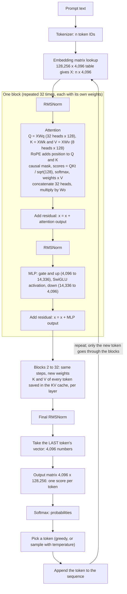

# Language Models to LLMs: Study Notes

_The story in one chain: counting words (N-gram) → words as vectors (embeddings) → remembering the past (RNN) → looking at everything at once (attention/Transformer) → the LLM. At every stage the job is the same: estimate **P(next token | context)**._

## Contents

0. [Big picture: an LLM in one page](#0-big-picture-an-llm-in-one-page)
1. [What a language model does](#1-what-a-language-model-does)
2. [N-gram language model](#2-n-gram-language-model)
3. [Embeddings: words as vectors](#3-embeddings-words-as-vectors)
4. [RNN](#4-rnn)
5. [Transformers and how an LLM works](#5-transformers-and-how-an-llm-works)
6. [What the weights are](#6-what-the-weights-are)
7. [Link to RAG](#7-link-to-rag)

---

## 0. Big picture: an LLM in one page

Read this first. The later sections zoom into each piece.

An LLM is one function:

```
token IDs  →  [ lookup table ]  →  [ N identical blocks ]  →  [ output matrix ]  →  probability for every next token
```

### 0.1 A neural network in 30 seconds

A "layer" multiplies a vector by a weight matrix, adds a bias, and applies a non-linear function:

```
x = [1, 2]    W = [[1, 0],     b = [-1, 0]
                  [1, 1]]

xW = [1×1 + 2×1,  1×0 + 2×1] = [3, 2]
+ b                           = [2, 2]
ReLU (replace negatives by 0) = [2, 2]
```

- **Weights (W):** the matrix of learned numbers. These are the "knobs".
- **Bias (b):** a small vector added after the multiplication. Many modern LLMs (Llama) have none.
- **Non-linear function:** without it, stacked layers collapse into one big matrix multiply and could not learn complex patterns.

A neural network is many of these stacked. Training adjusts the knobs, and nothing else is stored.

### 0.2 The parts of an LLM (Llama 3 8B as the example)

```
text → tokenizer → token IDs
                      │
        ┌─────────────▼─────────────┐
        │ EMBEDDING MATRIX          │  128,256 × 4,096   ID = row number → one vector per token
        └─────────────┬─────────────┘
                      │ vectors [n, 4096]
        ┌─────────────▼─────────────┐
        │ BLOCK 1  (a "layer")      │
        │   attention:  Wq Wk Wv Wo │  4 weight matrices
        │   MLP:  gate, up, down    │  3 weight matrices
        │   (+ small norm vectors)  │
        ├───────────────────────────┤
        │ BLOCK 2 ... BLOCK 32      │  same shapes, different values
        └─────────────┬─────────────┘
                      │ vectors [n, 4096]
        ┌─────────────▼─────────────┐
        │ OUTPUT MATRIX (LM head)   │  4,096 × 128,256   vector → one score per token
        └─────────────┬─────────────┘
                      ▼
              probabilities for the next token
```

| Term | What it is |
|---|---|
| **Embedding matrix** | The first lookup table: token ID → vector. A weight matrix (details in 5.2). |
| **Weight matrix** | Any trained matrix (Wq, Wk, Wv, Wo, MLP matrices, embedding, output head). |
| **Bias** | A small trained vector added after a multiply. Not a matrix. |
| **Layer / block** | One repeating unit: attention + MLP. Stacked 32 times. |
| **Head** | One of several parallel "searches" inside attention. Llama has 32, each working on 128 of the 4,096 numbers, and their results are joined back. |
| **Hidden state** | The vector for a token as it travels between blocks (`[n, 4096]`). |
| **Parameters** | Every number in all of these matrices (8 billion in total, see 6.4). |

### 0.3 How training works

Training teaches the weights by repeating one loop, billions of times:

```
1. Take a text snippet:       "The cat sat on the mat"
2. At each position the target is the next token:
      The → cat   |  The cat → sat  |  The cat sat → on  |  ...  |  ... on the → mat
3. Forward pass: the model outputs a probability for each possible next token
4. Loss = -ln(probability given to the CORRECT token)
5. Backpropagation: compute how each weight affects the loss
6. Update: nudge every weight slightly to lower the loss   (optimizer, e.g. AdamW)
7. Repeat with the next batch
```

Loss example: if the model gave the correct token `mat` a probability of 0.01, the loss is -ln(0.01) = 4.6. After training, if it gives 0.6, the loss is 0.51. Lower loss means a better prediction.

- **Start:** all weights random, so the model outputs nonsense.
- **Data:** a huge amount of text (trillions of tokens). Every position in every snippet is a free training example, because the "label" is just the next word.
- **Result:** the weights end up encoding grammar, facts and patterns, because predicting the next word well requires them.
- **After pretraining:** later stages (instruction tuning, human feedback) teach it to follow instructions. The same weights keep being adjusted.
- **Why Transformers:** RNNs process words one at a time and forget over long text. A Transformer processes all tokens in parallel, and attention lets any token read directly from any earlier token. That scales to huge data on GPUs.

### 0.4 How the next word is predicted

Example: the prompt is `The cat sat on the` and the model must produce the next token.

```
1. Tokenize                       → 5 token IDs
2. Embedding lookup               → 5 vectors, one per token (same vector for "the" everywhere)
3. Position information           → the model learns order (GPT-2 adds position vectors; Llama rotates Q and K)
4. Repeat for each of 32 blocks:
     a. ATTENTION: each token gathers information from earlier tokens
     b. MLP:       each token processes what it gathered
5. Take the LAST token's final vector (the one for "the")
6. Output matrix → one score per vocabulary token → softmax → probabilities
      mat 0.35 | floor 0.20 | couch 0.10 | ...        (illustrative)
7. Pick a token (highest, or sample using temperature) → "mat"
8. Append it to the input and repeat from step 1 (the KV cache avoids recomputing old tokens)
```

**Why the last token's vector?** In causal attention it has looked at every earlier token, so it carries the information needed to predict what comes after it.

**Q, K, V as a library:**
- **Query (Q):** what I'm searching for.
- **Key (K):** the label on each book (what it is about).
- **Value (V):** the content of each book.

```
Last token "the" asks (Q):  "who is the subject and what is happening?"
Keys of "cat", "sat", "on" match that question to different degrees      → scores = Q·K
Softmax turns the scores into reading percentages                         → weights (sum to 1)
It reads a blend of the books' content                                    → weights × V
```

- **Why:** a token's meaning depends on its neighbours. Attention is how information moves between tokens.
- **How:** Q, K and V are computed from the token vector with the matrices Wq, Wk and Wv. Then `softmax(Q·Kᵀ/√d) × V`, and Wo mixes the result (see 5.3 and 5.4).
- **When:** in every block, for every token, at every generation step.
- **Heads:** 32 of these searches run in parallel. One might track which noun an adjective describes, another the previous word, and so on (see 5.6 and 5.7).
- **Causal mask:** a token can only look at itself and earlier tokens. It can't peek ahead, which is what makes next-word training valid.

**MLP:** after attention gathers information, the MLP processes each token on its own: it expands the vector (4,096 → 14,336), applies an activation, and shrinks it back. Researchers think much of the model's stored factual knowledge sits in these matrices.

**Block wiring:**

```
x = x + Attention(Norm(x))    ← gather context from other tokens
x = x + MLP(Norm(x))          ← process it per token
```

The `x + ...` is a **residual connection**: the result is added back to the input so earlier information isn't lost. Early blocks tend to capture simple patterns (word forms, grammar) and later ones more abstract meaning.

### 0.5 One-paragraph summary

An LLM turns each token ID into a vector (embedding matrix), repeatedly refines every vector by letting tokens read from earlier tokens (attention with Wq, Wk, Wv, Wo) and processing them (MLP), then turns the last token's vector into a probability for every possible next token (output matrix). Training starts with random weights and, by repeatedly predicting the next token and nudging every weight to reduce the error, ends with weights that encode language and facts.

---

## 1. What a language model does

- A language model (LM) calculates the **probability of the next word** (more exactly, the next token).
- To know the next word, the LM first needs the previous words. Example: `THE SKY IS ...` can be followed by many things.
- This earlier text is the **context** the model uses to predict the next word.
- One way to predict is to store lots of text where this sentence might appear, then see what usually comes next.
- But the context might appear in the data many times, once, or never:
    1. `THE SKY WAS`
    2. `SKY`
    3. Not present at all
    4. `THE SKY WAS RED`
    5. `THE SKY WAS BLUE`
    6. `THE SKY WAS CLOUDY`
- So the idea is to calculate the probability of each possible next word given the context.

Questions this doc answers:
- How are relations between words represented? (A vector? A matrix?)
- How is the probability calculated?
- Why did simple approaches stop working, and what replaced them?

---

## 2. N-gram language model

### 2.1 The idea

- Store the data, then search it to find the next word. For example, find a word in a paragraph and take the word at position n+1.
- Storing all the world's text as-is and searching it would be far too slow.
- So the model stores **counts** (which words follow which) instead of raw text, and turns counts into probabilities.

An N-gram model predicts the probability of a word based on a fixed history of the preceding words.

### 2.2 Core concepts

- **Markov assumption:** the probability of a word depends only on the previous `n-1` words, not the whole history.
- **Markers:** `<s>` marks the start of a sentence (so the model learns which words usually open one) and `</s>` marks the end.
- **N-gram types** (N is the window size):
    - Unigram (N=1): single words, no context (`cat`).
    - Bigram (N=2): pairs of words (`the cat`).
    - Trigram (N=3): triplets of words (`the cat slept`).

### 2.3 How the model trains

Training is an automated text-splitting and counting game over a text dataset (corpus):

1. **Tokenisation:** lowercase the text, remove punctuation, attach `<s>` and `</s>`.
2. **Sliding window:** move an N-sized window across the text one word at a time.
3. **Counting:** tally how often each word and each word combination occurs.

Reference corpus:

```
<s> the cat sat </s>
<s> the cat slept </s>
<s> a dog slept </s>
```

### 2.4 Where the numbers come from

**Row 1: `<s>` to `the`.** How often does a sentence start with `the`?
- Count of pair (`<s>`, `the`): sentences 1 and 2 start with `the`, sentence 3 with `a`, so 2.
- Count of `<s>`: 3 sentences, so 3.
- P(the | `<s>`) = 2/3 ≈ 0.67.

**Row 2: `the` to `cat`.** If the word is `the`, how likely is `cat` next?
- Count of pair (`the`, `cat`): sentences 1 and 2, so 2.
- Count of `the`: 2.
- P(cat | the) = 2/2 = 1.0 (in this tiny dataset `cat` always follows `the`).

**Row 3: `cat` to `slept`.**
- Count of pair (`cat`, `slept`): 1 (sentence 2).
- Count of `cat`: 2 (sentences 1 and 2).
- P(slept | cat) = 1/2 = 0.5.

**Row 4: `slept` to `</s>`.**
- Count of pair (`slept`, `</s>`): 2. Count of `slept`: 2.
- P(`</s>` | slept) = 2/2 = 1.0.

**Whole sentence** `<s> the cat slept </s>`: multiply the four results.

```
2/3 × 1 × 1/2 × 1 = 1/3 ≈ 0.333   (33.3%)
```

Rounding the first value to 0.67 gives 0.335; the exact answer is 0.333.

### 2.5 How the model stores data

To search quickly, the model uses a **nested dictionary** (a map within a map), grouped by the previous word (the context). For the reference corpus the bigram memory looks like this:

```
{
  "<s>":   { "the": 2, "a": 1 },
  "the":   { "cat": 2 },
  "cat":   { "sat": 1, "slept": 1 },
  "a":     { "dog": 1 },
  "dog":   { "slept": 1 },
  "sat":   { "</s>": 1 },
  "slept": { "</s>": 2 }
}
```

The count of a context word is the sum of its inner values (for example `cat` = 1 + 1 = 2).

### 2.6 How data is retrieved and calculated

The model slides a window over the sentence and pulls values from the dictionary to compute conditional probabilities.

Conditional probability (bigram):

$$P(w_n \mid w_{n-1}) = \frac{\text{Count}(w_{n-1}, w_n)}{\text{Count}(w_{n-1})}$$

Probability of a whole sentence (multiply the pairs):

$$P(w_1, w_2, \dots, w_n) = \prod_{i=1}^{n} P(w_i \mid w_{i-1})$$

### 2.7 Walkthrough: "the cat slept"

Processed text: `<s> the cat slept </s>`

1. P(the | `<s>`): look up key `<s>`, sub-key `the` = 2, total for `<s>` = 2 + 1 = 3, so 2/3.
2. P(cat | the): key `the`, sub-key `cat` = 2, total = 2, so 2/2 = 1.
3. P(slept | cat): key `cat`, sub-key `slept` = 1, total = 1 + 1 = 2, so 1/2.
4. P(`</s>` | slept): key `slept`, sub-key `</s>` = 2, total = 2, so 2/2 = 1.

$$P(\text{the cat slept}) = \tfrac{2}{3} \times 1 \times \tfrac{1}{2} \times 1 = \tfrac{1}{3}$$

### 2.8 Why N-grams stop working

N-grams predict by what has been seen. The real problems are:

| Problem | What happens |
|---|---|
| **Sparsity** | A context that never appeared (the "not present" case above) has count 0, so its probability is 0 or undefined (0/0). Fixes like smoothing and backoff help, but only partly. |
| **Storage growth** | With a 50,000-word vocabulary there are up to 50,000² = 2.5 billion possible bigrams and 50,000³ = 125 trillion trigrams. |
| **Short context** | The model only sees the last `n-1` words, and a larger `n` makes sparsity worse. |
| **No generalization** | Seeing `the cat slept` tells it nothing about `the dog slept`. It doesn't know `cat` and `dog` are similar. |

More data actually helps N-grams; the trouble is longer contexts and unseen combinations. The fix is to represent words by **meaning** instead of exact matches, using vectors, which lets a neural network handle contexts it has never seen.

---

## 3. Embeddings: words as vectors

Instead of counts in a table, every word (or sentence) becomes a list of numbers called a **vector**. Its position, length and angle carry meaning. Real models use hundreds or thousands of dimensions (768, 1536, 4096), not 2.

Example 2D vectors: $A = [0.1, 0.7]$ and $B = [0.4, 0.3]$.

### 3.1 Length (magnitude)

The length of a vector is its Euclidean (L2) norm:

$$\lVert A \rVert = \sqrt{x^2 + y^2} = \sqrt{0.1^2 + 0.7^2} = \sqrt{0.50} \approx 0.707$$

### 3.2 Direction

Direction is the vector divided by its length (the unit vector):

$$\frac{A}{\lVert A \rVert} = \left[\frac{0.1}{0.707}, \frac{0.7}{0.707}\right] \approx [0.141, 0.990]$$

To compare the directions of two vectors we measure the angle θ between them.

### 3.3 Dot product and cosine similarity

The dot product links coordinates and geometry:

$$A \cdot B = \lVert A \rVert \, \lVert B \rVert \cos(\theta)$$

Step A: multiply matching coordinates and add them.

```
A·B = (0.1 × 0.4) + (0.7 × 0.3) = 0.04 + 0.21 = 0.25
```

Step B: the magnitudes.

```
‖A‖ = √(0.1² + 0.7²) ≈ 0.707
‖B‖ = √(0.4² + 0.3²) = √0.25 = 0.5
```

Step C: rearrange to get the cosine, which says how aligned the directions are (1 = same direction, 0 = perpendicular, -1 = opposite):

$$\cos(\theta) = \frac{A \cdot B}{\lVert A \rVert \, \lVert B \rVert} = \frac{0.25}{0.707 \times 0.5} \approx 0.707$$

cos(θ) ≈ 0.707 means θ = 45°: a moderately strong alignment (similarity).

### 3.4 Summary

- A vector is a point in space representing a concept.
- Length = square root of the sum of squared coordinates.
- Direction similarity = dot product divided by the product of the lengths (cosine).

---

## 4. RNN

N-grams only work on exact contexts they have seen. A neural network (NN) learns from data and, because words are vectors, can predict even when the exact context never appeared.

A **Recurrent Neural Network (RNN)** processes sequential data (text, speech, time series) by passing a "hidden state" (memory) from one step to the next. Unlike a feed-forward network, it has a loop.

### 4.1 How an RNN works

- **Current input** `x_t`: the data at this step (for example one word).
- **Previous hidden state** `h_{t-1}`: the memory from the previous step.
- **New hidden state** `h_t`: the updated memory, from the current input and the old memory through an activation function (often tanh):

$$h_t = \tanh(W_{xh}\, x_t + W_{hh}\, h_{t-1} + b)$$

- **Output** `y_t`: the prediction at this step.

### 4.2 Intuitive example

Reading "The clouds are dark, it might rain."
- A network that only sees the word "rain" lacks context.
- An RNN reads "The", then "clouds", keeping a running memory in its hidden state. By the end, that memory helps it predict the upcoming words.

### 4.3 Sample code (from scratch)

A toy scalar RNN cell with fixed weights (a real RNN learns them):

```python
import math

class SimpleRNNCell:
    def __init__(self):
        self.w_xh = 0.2   # input -> hidden weight
        self.w_hh = 0.5   # previous hidden -> hidden weight
        self.bias = 0.0

    def step(self, x_t, h_prev):
        z = x_t * self.w_xh + h_prev * self.w_hh + self.bias
        return math.tanh(z)   # squashes to between -1 and 1

    def forward(self, sequence):
        h_t = 0.0             # starting memory
        hidden_states = []
        for x_t in sequence:
            h_t = self.step(x_t, h_t)
            hidden_states.append(h_t)
        return hidden_states

rnn_cell = SimpleRNNCell()
input_sequence = [0.5, 0.8, -0.2, 1.0]
outputs = rnn_cell.forward(input_sequence)
for i, val in enumerate(outputs):
    print(f"Time step {i+1} (Input: {input_sequence[i]}): Hidden State = {val:.4f}")
```

Output:

```
Time step 1 (Input: 0.5): Hidden State = 0.0997
Time step 2 (Input: 0.8): Hidden State = 0.2068
Time step 3 (Input: -0.2): Hidden State = 0.0633
Time step 4 (Input: 1.0): Hidden State = 0.2276
```

### 4.4 Why RNNs were replaced

- **Sequential:** each step needs the previous one, so training can't be parallelized well.
- **Vanishing gradients:** learning signals fade over long sequences, so distant words are hard to use.
- **One fixed-size memory:** the whole past must be squeezed into one hidden state.
- LSTM and GRU help with the memory problem but keep the sequential design.

**Attention** (next section) removes these limits by letting every token look directly at every other token.

---

## 5. Transformers and how an LLM works

Tracing a paragraph through an LLM step by step: how vectors are born, how dimensions are chosen, and how Q, K, V are calculated.

### 5.1 Text to token IDs

Before any math, a **tokenizer** splits the text into tokens (words or pieces of words) and maps each to an ID in the vocabulary. GPT-2's vocabulary has 50,257 entries (IDs 0 to 50,256).

```
Text:       "The cat slept."
Token IDs:  [464, 3797, ..., 13]     (illustrative; tokens include leading spaces, e.g. " cat")
```

To get real IDs, run the text through the model's own tokenizer.

### 5.2 The initial vector: the embedding layer

The embedding layer is a big table with one row per vocabulary token (`vocab size × d_model`). The token ID is a row number. Before training the rows are random numbers (`[0.012, -0.004, 0.911, ...]`), so "cat" and "The" are at random positions. Training changes them.

The number of dimensions (`d_model`) depends on the model:

| Model | Dimensions |
|---|---|
| GPT-2 Small / Medium / Large / XL | 768 / 1,024 / 1,280 / 1,600 |
| GPT-3 175B | 12,288 |
| Llama 3 8B | 4,096 |
| OpenAI `text-embedding-3-small` (an embedding model) | 1,536 |

GPT-4's size is not public.

### 5.3 Q, K, V

Each Transformer layer has three weight matrices, $W_Q$, $W_K$, $W_V$. Multiplying a token's vector by each gives three new vectors:

```
                ┌───► × W_Q ───► Query (Q)   what am I looking for?
Word vector ────┼───► × W_K ───► Key   (K)   what do I offer to others?
                └───► × W_V ───► Value (V)   what content do I contribute?
```

**Are Q, K, V stored?** The weights $W_Q$, $W_K$, $W_V$ are stored (they are part of the model). The Q, K, V *values* are not stored permanently; they are computed on the fly for every token each time text passes through. During generation an LLM keeps the K and V of earlier tokens in a temporary **KV cache** so they aren't recomputed.

### 5.4 Attention math

$$\text{scores} = \frac{Q K^\top}{\sqrt{d_k}}, \qquad \text{weights} = \text{softmax}(\text{scores}), \qquad \text{output} = \text{weights} \times V$$

- Score: dot product of one token's Query with every Key (high when they align).
- Softmax turns scores into weights that sum to 1.
- Output: weights times the Value vectors, a mix of the tokens' content. The token's vector is dragged towards the tokens it attends to.

In a decoder LLM, a token only attends to itself and **earlier** tokens (causal attention). In "the cat slept", the vector for `slept` is pulled towards `cat`, not the other way round. Embedding models (encoders) let every token see all others.

### 5.5 How training updates the values

1. **The mistake:** with random numbers, the model guesses the word after "The cat" is "refrigerator".
2. **The loss:** the real word was "slept". The error (cross-entropy of the predicted next-token probability) is the loss.
3. **Backpropagation:** the error is sent backwards, and an algorithm adjusts $W_Q$, $W_K$, $W_V$, the other weights, and the embedding table itself.

Over billions of pages, words used in similar ways (like "cat" and "dog") get nudged until their positions and angles represent meaning. The training objective is the same quantity N-grams estimated: P(next token | context), now produced by a neural network and a softmax instead of counts.

### 5.6 Attention heads: what, why, how many

**What is a head?** One independent attention "search" that works on its own slice of each token's Q, K and V. The model runs several in parallel and joins their results.

| | MiniLM (embedding model) | Llama 3 8B |
|---|---|---|
| `d_model` | 384 | 4,096 |
| Heads | 12 | 32 |
| Head size | 32 | 128 |

The three are linked: `d_model = heads × head size` (12 × 32 = 384, 32 × 128 = 4,096).

**How is the number of heads decided?** It is a **hyperparameter**: the designers choose it before training, and training never changes it.
- `d_model` must divide evenly by the number of heads.
- Typical head sizes are 64 or 128 (BERT-base: 768 / 12 = 64). A wider model gets more heads.
- More heads give more different attention patterns, but smaller vectors per head. Compute stays about the same (12 heads × 32 equals one head of 384). Too small a head size hurts quality.
- It is picked by experiments and scaling tests, not a formula.

**Does a head contain weights or only calculations?** Both:
- The calculations (scores, softmax, weights × V) have no learned numbers.
- The weights are **slices of the big matrices**. Wq is one `d_model × d_model` matrix whose columns are grouped; head `h` uses its own group (Wk and Wv work the same way). Wo is one shared matrix that mixes all the heads' outputs.

```
MiniLM, per head:  Wq_h [384 × 32] + Wk_h [384 × 32] + Wv_h [384 × 32] = 36,864 numbers
12 heads:          12 × 36,864 = 442,368 = 3 × 384²   (the same total as the three big matrices)
```

So heads are not extra weights on top of the matrices. They are the same matrices read in groups of columns.

**Are heads trained on different data?** No. All heads are trained **together, on the same data, with the same loss**. Each head's weights start with different random numbers and get different gradients, so they drift into different roles (for example tracking the previous word, or which noun an adjective describes). Nobody assigns a head to a word or a dataset. Many heads are redundant, and some can be removed with little loss.

**Will two heads give the same output for `river bank` and `money bank`?** No. Heads don't memorize words. The **same weights** are applied to every input, and the output differs because the **input differs**:

```
"river bank":  bank's Query is compared with the Keys of [river, bank]  → blend leans nature
"money bank":  bank's Query is compared with the Keys of [money, bank]  → blend leans finance
```

Even a single head with fixed weights gives different results. In the RAG guide's worked example, the same `bank` vector `[0.7, 0.7]` becomes `[0.89, 0.415]` in `river bank` and `[0.415, 0.89]` in `money bank`. Further heads and layers refine it more.

**Head size is not the context window:**

| Term | Meaning | MiniLM | Llama 3 8B |
|---|---|---|---|
| `d_model` | Numbers per token vector | 384 | 4,096 |
| Head size | Numbers per token inside one head (width of Q, K, V) | 32 | 128 |
| `n` (context length) | **How many tokens** the model processes | up to 256 | 8,192 |

Each head's score grid is `n × n` (tokens × tokens). Head size only sets the width of Q, K and V (`[n, 32]`).

**Hallucination:** if a model failed to separate the two meanings of `bank`, that would be a wrong-meaning error, not hallucination. Hallucination is plausible but unsupported text, because the model is trained to output likely tokens and has knowledge gaps and no grounding. Retrieved context (RAG) reduces it.

### 5.7 Heads vs K/V heads vs head size

Each head needs a Q, K and V. The model can give every head its own K and V, or let several heads share them.

| Term | Meaning | Llama 3 8B | MiniLM |
|---|---|---|---|
| **Heads** (query heads) | Separate attention searches, each with its own Q | 32 | 12 |
| **Head size** | Numbers per head (same for Q, K, V) | 128 | 32 |
| **K/V heads** | Separate sets of K and V | 8 | 12 |

```
MiniLM (standard multi-head attention, MHA):
  12 query heads, 12 K/V heads  → every head has its own Q, K, V   (1 : 1)

Llama 3 8B (grouped-query attention, GQA):
  32 query heads, 8 K/V heads   → 4 query heads share each K/V pair

  K/V head 1 ← query heads 1, 2, 3, 4
  K/V head 2 ← query heads 5, 6, 7, 8
  ...
  K/V head 8 ← query heads 29, 30, 31, 32
```

- All 32 query heads still compute their own scores and weights (32 attention grids). Heads in a group look in different ways (different Q) but read the same keys and values.
- Variants: **MHA** (K/V heads = heads), **GQA** (fewer K/V heads), **MQA** (a single K/V head).

| | With 32 K/V heads | With 8 K/V heads (actual) |
|---|---|---|
| Wq | 4,096 × 4,096 | 4,096 × 4,096 (32 × 128, unchanged) |
| Wk and Wv | 4,096 × 4,096 each | **4,096 × 1,024 each** (8 × 128) |
| KV cache per token | 512 KB | **128 KB** |

The benefit is a 4× smaller KV cache and less memory traffic during generation, with only a small quality loss.

### 5.8 KV cache: per layer and per head

The KV cache is kept **per layer and per K/V head**:

```
[ layers ] × [ K and V ] × [ K/V heads ] × [ tokens so far ] × [ head size ]
```

- **Per layer:** K and V are computed from that layer's input, so every layer has different values. Layer 5 can't reuse layer 3's cache.
- **Per head:** each K/V head has its own Wk and Wv slice, so each stores its own K and V.
- **Per token:** one K and one V per layer and head for every token so far. The cache grows with every new token.

Llama 3 8B in fp16:

```
per token = 32 layers × 2 (K and V) × 8 K/V heads × 128 numbers × 2 bytes = 131,072 bytes = 128 KB
```

Only K and V are cached. Q is not, because it is only needed for the current token's own attention step. Embedding models like MiniLM have no cache.

### 5.9 Full flow of an LLM: transformer and layers

Llama-style decoder, with Llama 3 8B sizes:



Shapes for `n` prompt tokens:

| Step | Shape |
|---|---|
| Token IDs | `[n]` |
| After embedding lookup (`X`) | `[n, 4096]` |
| Q | `[32, n, 128]` |
| K and V | `[8, n, 128]` each |
| Scores / weights | `[32, n, n]` |
| Attention output after Wo | `[n, 4096]` |
| MLP hidden | `[n, 14336]` |
| Block output | `[n, 4096]` |
| Last token's vector | `[4096]` |
| Output scores (logits) / probabilities | `[128256]` |

How the pieces run:
- **Prefill:** the first pass sends all `n` prompt tokens through the 32 blocks in parallel and fills the KV cache.
- **Decode:** every following step sends **only the new token** through the blocks. It attends to the cached K and V of all earlier tokens and adds its own to the cache.
- **Inside a block:** the heads run together in one batched operation; attention and the MLP run in order.
- **Across blocks:** strictly in order, because block 2 needs block 1's output.
- **Position:** Llama applies RoPE to Q and K inside attention instead of adding position vectors to the embeddings (GPT-2 and BERT-style models add them at the start).

---

## 6. What the weights are

### 6.1 Storage and calculation are the same thing

An LLM has no separate memory drive. Its knowledge lives in the **weights and biases**, which both store and compute.

| | Traditional computer | LLM |
|---|---|---|
| Memory | Hard drive / RAM (data sits passively) | Weight matrices and biases (knowledge baked into connection strengths) |
| Processing | CPU / GPU runs logic on the data | Matrix multiplication; processing the input activates the baked-in knowledge |

- During training, weights are adjusted so that "Paris is the capital of..." steers the output towards "France". The fact isn't stored as text.
- Running the model (the calculation) is how the knowledge is retrieved.
- After each matrix multiplication an **activation function** (GELU, or SwiGLU in Llama) decides how much signal moves on.

Analogy: grooves on a vinyl record. The grooves are the song (data) and also what produces the sound when the needle passes (calculation).

This is "parametric" memory (in the weights, fixed after training). RAG adds "retrieved" memory: facts placed in the prompt at request time (section 7).

### 6.2 Weights vs biases

- **Weights** are stored as **matrices** (2D grids). They connect every input to every output.
- **Biases** are stored as **vectors** (1D lists). One offset per output neuron.

A layer computes $Y = XW + B$:

| Part | Form | Example shape | Meaning |
|---|---|---|---|
| Inputs `X` | Vector | 1 × 4 | Incoming data |
| Weights `W` | Matrix | 4 × 3 | Connection strengths |
| Biases `B` | Vector | 1 × 3 | Offset per output |
| Outputs `Y` | Vector | 1 × 3 | Result before the activation |

Shape conventions differ: with $Y = XW$ the matrix is 4 × 3, but PyTorch stores it transposed as `[out, in]` = 3 × 4. It is the same matrix.

```python
import torch
import torch.nn as nn

layer = nn.Linear(in_features=4, out_features=3)
print(f"Weight shape: {layer.weight.shape}")  # torch.Size([3, 4])  matrix, stored as [out, in]
print(f"Bias shape:   {layer.bias.shape}")    # torch.Size([3])     vector
```

### 6.3 Who decides the sizes and values

**Sizes are decided before training**, by engineers, as the model's architecture. The main choices:

| Setting | Llama 3 8B |
|---|---|
| Vocabulary size `V` | 128,256 |
| Hidden dimension `d_model` | 4,096 |
| Layers | 32 |
| Attention heads / K,V heads | 32 / 8 |
| Feed-forward (MLP) size | 14,336 |

Matrix multiplication needs dimensions to line up, so these settings fix every matrix shape:

| Part | Weight matrix shape |
|---|---|
| Embedding table | `V × d_model` = 128,256 × 4,096 |
| Query (Wq) and output (Wo) | 4,096 × 4,096 |
| Key (Wk) and value (Wv) | 4,096 × 1,024 (grouped-query attention: 8 K/V heads × 128) |
| MLP gate and up | 4,096 × 14,336 |
| MLP down | 14,336 × 4,096 |
| Output head | `d_model × V` = 4,096 × 128,256 |

Llama has **no bias vectors** in these layers. Older GPT-2/BERT-style models do have one bias vector per layer (`d_model` numbers for attention, for example).

**Values are decided by training.** The matrices start random, and gradient descent keeps changes that lower the prediction error across trillions of words. For example, repeated "The capital of France is Paris" builds a strong path from the representation of "France" to the output slot for "Paris".

Analogy: engineers decide how many conveyor belts and sorting bins exist; the data running through is what moves the levers into their final positions.

### 6.4 Why a model is called "8B": counting parameters

The parameter count is the total number of values across all weight matrices and bias vectors. Llama 3 8B:

| Part | Calculation | Parameters |
|---|---|---|
| Attention (Wq + Wk + Wv + Wo) | 16.8M + 4.2M + 4.2M + 16.8M | 41,943,040 |
| MLP (gate + up + down) | 3 × 4,096 × 14,336 | 176,160,768 |
| Two RMSNorm vectors | 2 × 4,096 | 8,192 |
| **One layer** | | **218,112,000** |
| 32 layers | 32 × 218,112,000 | 6,979,584,000 |
| Input embedding table | 128,256 × 4,096 | 525,336,576 |
| Output head | 4,096 × 128,256 | 525,336,576 |
| Final norm | | 4,096 |
| **Total** | | **8,030,261,248** |

The file you download is about 8 billion numbers (about 16 GB at 2 bytes each in fp16). Running the model means pushing your prompt vectors through those matrices.

### 6.5 One layer, matrix by matrix

A layer contains **7 weight matrices**: 4 for attention and 3 for the MLP (plus small norm vectors).

```
[Your prompt vectors]
       │
       ▼
 ┌───────────┐
 │ Layer 1   │ ──► Attention: Wq, Wk, Wv, Wo    (4 matrices)
 │           │ ──► MLP:       gate, up, down    (3 matrices)
 └───────────┘
       │
       ▼
 ┌───────────┐
 │ Layer 2   │ ──► same 7 matrices, different values
 └───────────┘
       │
 (repeats for 32 layers)
       │
       ▼
[Output head → probability for every next token]
```

---

## 7. Link to RAG

- The LLM is a **decoder** (causal attention, next-token output, KV cache). The embedding model used for RAG search is an **encoder** (every token sees all tokens, outputs one vector). Both have trained, frozen weights including Wq, Wk, Wv.
- Retrieved chunks reach the LLM only as **text in the prompt**; they are not stored in its weights.
- Details: [RAG_COMPLETE_GUIDE.md](./RAG_COMPLETE_GUIDE.md), sections 3 and 6.


- Heads/query heads: per layer
- Head size = dimensions/heads 
- k/v heads = shared by heads or each head can have its own
    - ex. Llama 3 8B
        - 32 QUERY HEADS    
        - 8 k/V HEADS:  4 heads share same k/v head
        - 
- KV cache shape (one request):
[ layers ] × [ K and V ] × [ K/V heads ] × [ tokens so far ] × [ head size ]
- token size: 32 layer X 2 (k and v) X 8 K/V heads X 128 heads size X 2 bytes