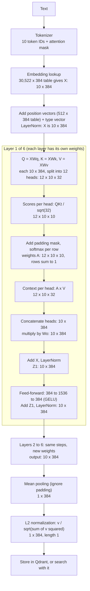

# RAG Complete Guide: From Document to Answer

_The complete RAG learning guide in one document. It follows the order the data moves through the system, so you can read it top to bottom once._

**Code:** [embedding.js](../01_RAG/services/embedding.js) uses `@xenova/transformers` with the model `Xenova/all-MiniLM-L6-v2` (384 dimensions, 256 token limit).

## Contents

1. [The big picture](#1-the-big-picture)
2. [Preparing the text: cleaning and chunking](#2-preparing-the-text-cleaning-and-chunking)
3. [The embedding pipeline](#3-the-embedding-pipeline)
   - [3.0 Overview](#30-overview)
   - [Step 1: Tokenization](#step-1-tokenization)
   - [Step 2: Token IDs to vectors (the transformer)](#step-2-token-ids-to-vectors-the-transformer)
   - [Step 3: Pooling](#step-3-pooling)
   - [Step 4: Normalization](#step-4-normalization)
4. [Storing vectors in Qdrant](#4-storing-vectors-in-qdrant)
5. [Searching](#5-searching)
6. [Generating the answer: the LLM side](#6-generating-the-answer-the-llm-side)
7. [Chunk size vs dimensions vs accuracy](#7-chunk-size-vs-dimensions-vs-accuracy)
8. [Mapping to code](#8-mapping-to-code)
9. [Common confusions](#9-common-confusions)
10. [Debug checklist](#10-debug-checklist)
11. [Key takeaways](#11-key-takeaways)
12. [Open questions](#12-open-questions)
- [Appendix A: Glossary](#appendix-a-glossary)

---

## 1. The big picture

### 1.1 What RAG is

**Retrieval-Augmented Generation:** instead of asking the LLM to answer from memory, you first **retrieve** the most relevant pieces of your own documents and put them in the prompt, so the LLM **generates** an answer grounded in them.

Three ideas make it work:
1. **Chunk:** split documents into small focused pieces.
2. **Embed:** turn each piece (and each question) into a vector of numbers that captures its meaning.
3. **Retrieve:** find the chunks whose vectors are closest to the question's vector.

### 1.2 What an embedding is

An **embedding** is a list of numbers (a vector) that represents the **meaning** of a text in a form computers can compare mathematically.

```
"JavaScript developer"  →  [0.12, -0.45, 0.78, ..., 0.33]   (384 numbers)
"Node.js programmer"    →  [0.11, -0.43, 0.76, ..., 0.31]   (384 numbers)  ← similar!
"Pizza recipe"          →  [-0.56, 0.22, -0.11, ..., 0.89]  (384 numbers)  ← very different
```

Texts with similar **meaning** end up with similar vectors (close together in 384-dimensional space), even if they use completely different words.

### 1.3 Why not just keyword search?

| Query | Keyword search finds | Embedding search finds |
|---|---|---|
| "JS experience" | Documents with "JS" | Documents about JavaScript, Node.js, React |
| "backend developer" | Documents with "backend" | Documents about Node.js, APIs, databases |

Embeddings understand **semantics**, not just exact word matches.

### 1.4 The full flow

RAG has two flows that share the same embedding step.

```
UPLOAD / INDEXING FLOW (once per document)
  File (PDF, DOCX, ...)
    → extract text
    → clean
    → chunk (500 chars, 100 overlap)
    → for each chunk: [EMBED] → 384-dim unit vector
    → store in Qdrant: { id, vector, payload: chunk text + metadata }

ASK / QUERY FLOW (every question)
  Question
    → [EMBED]  → 384-dim unit vector (the query vector)
    → Qdrant similarity search (cosine, HNSW index) against stored vectors
    → top-K chunks (the text comes from the payload)
    → build prompt: "Answer ONLY from context: {chunks}  Question: {question}"
    → LLM streams tokens back
    → streaming answer → user
```

**The key rule:** chunks and questions must be embedded with the **same model and the same steps**. Only then are their vectors comparable.

Sections 2 to 6 follow this flow in order. `[EMBED]` is explained in section 3.

### 1.5 One-page recap (for revision)

**Saving a chunk (indexing):**

```
chunk text
  │ tokenizer                              → token IDs                       [1, n]
  │ transformer
  │   embedding lookup (ID → table row)     → one vector per token            [1, n, 384]
  │   + position vectors                   → vectors that know word order
  │   × 6 layers of (attention + feed-forward):
  │       Q, K, V = vectors × Wq, Wk, Wv    (frozen weights)
  │       scores  = Q·Kᵀ / √d               → n × n grid
  │       weights = softmax(scores)         → each row sums to 1
  │       new vector = weights × V          → context-mixed vector per token
  ▼
token vectors                                                              [1, n, 384]
  │ mean pooling (average, ignore padding)  → one vector per text           [1, 384]
  │ L2 normalization (divide by length)     → length 1, values in -1..1
  ▼
Qdrant point: { id, vector[384], payload: chunk text + metadata }
  → vector is added to the collection's HNSW index (distance = Cosine)
```

**Retrieving (query):**

```
question → same steps (tokenizer → transformer → pooling → normalization) → query vector [384]
  │ Qdrant ANN (HNSW) search: walks the graph, comparing vectors with the collection's metric
  │   (cosine; for unit vectors that is a plain dot product)
  ▼
top-K points (score + payload)
  │ take the payload TEXT of each point
  ▼
prompt = instructions + chunk texts + history + question
  → LLM (its OWN tokenizer and model) → streamed answer
```

**Easy-to-mix-up points:**

| Mix-up | Correct |
|---|---|
| "Add position: K" | Position vectors are added to the token vectors **before** attention. K is computed **afterwards** from those vectors (K = vector × Wk) |
| "Dot product with K gives the new vector" | K is only used for the **scores**. New vector = softmax weights × **V** |
| "Normalization adds direction" | Direction is already in the vector. Normalization **removes the length** (length becomes 1) and keeps direction. Values end up in -1..1 as a result |
| "ANN, not sure about cosine" | ANN (HNSW) is the **search method**; cosine/dot is the **measure** it uses to compare vectors. It is set on the collection |
| "Give results to the LLM" | The LLM gets the chunk **text** (payload), never the vectors |

---

## 2. Preparing the text: cleaning and chunking

### 2.1 Text cleaning

Raw text from PDFs, DOCX and other formats contains noise that degrades embedding quality. The model wastes attention on meaningless tokens instead of the content.

| Noise type | Example | Problem |
|---|---|---|
| Extra whitespace | `"Hello     world"` | Wastes tokens on spaces |
| Repeated newlines | `"\n\n\n\n\n"` | Empty tokens dilute the embedding |
| Control characters | `\x00`, `\x0B` | Invisible garbage the model can't interpret |
| PDF artifacts | Page numbers, repeated headers/footers | Pollutes every chunk with the same irrelevant info |
| Unicode replacement chars | `\ufffd` | Failed encoding conversions |

```javascript
function cleanText(text) {
  return text
    .replace(/\r\n/g, '\n')                           // normalize line endings
    .replace(/\n{3,}/g, '\n\n')                        // collapse 3+ newlines → 2
    .replace(/[ \t]{2,}/g, ' ')                        // collapse multiple spaces/tabs
    .replace(/[^\S\n]+/g, ' ')                         // normalize whitespace (keep newlines)
    .replace(/[\x00-\x08\x0B\x0C\x0E-\x1F]/g, '')    // remove control chars
    .trim();
}
```

**Important:** do NOT remove all spaces or strip punctuation. The model needs natural language structure (sentence boundaries, commas, periods) to understand meaning.

```
BEFORE (raw PDF extract):
"   \n\n\n\nPage 3\n\n   The patient was    prescribed   metformin\x00 500mg\n\n\n\n\n"

AFTER (cleaned):
"Page 3\n\nThe patient was prescribed metformin 500mg"
```

The cleaned version gives a better embedding because every token carries meaning.

### 2.2 Chunking: why

Embedding models have a **token limit** (typically 256 to 512 tokens). If you feed a 10-page PDF as one string:

1. The model **truncates** it and loses most of the content.
2. Even if it fit, the embedding would be too **generic**: the meaning of 10 different topics averaged into one vector.

Chunking splits the text so each piece is small enough for the model and focused on **one topic/idea**, which makes search accurate.

### 2.3 Chunk size

Our code uses `size = 500` (characters):

```javascript
function chunkText(text, size = 500, overlap = 100) { ... }   // services/chunk.js
```

| Chunk size | Pros | Cons |
|---|---|---|
| Small (200-300) | Very precise search results | May split sentences mid-thought |
| Medium (500-800) | Good balance | Standard choice |
| Large (1000-2000) | Preserves full context | Dilutes specific info, may exceed the model limit |

Example resume text:

```
"Ganesh has 3 years experience in Node.js. He built REST APIs
using Express and NestJS. He also worked with DynamoDB and PostgreSQL.
His latest project involved microservices architecture with Docker and
Kubernetes deployment on AWS."
```

Small chunks (200 chars):

```
Chunk 1: "Ganesh has 3 years experience in Node.js. He built REST APIs using Express and NestJS."
Chunk 2: "He also worked with DynamoDB and PostgreSQL. His latest project involved microservices"
Chunk 3: "architecture with Docker and Kubernetes deployment on AWS."
```

Question "What databases?" → Chunk 2 is a perfect match. With **one big chunk** (all 500 chars), the match includes irrelevant text about Docker.

### 2.4 Overlap

**Overlap = the number of characters shared between consecutive chunks.** Our code uses `overlap = 100`.

```
Text: "AAAA BBBB CCCC DDDD EEEE FFFF"

Without overlap (size=10):
  Chunk 1: "AAAA BBBB "
  Chunk 2: "CCCC DDDD "     ← context is lost between chunks
  Chunk 3: "EEEE FFFF"

With overlap of 5 (size=10):
  Chunk 1: "AAAA BBBB "
  Chunk 2: "BBBB CCCC "     ← shares "BBBB" with chunk 1
  Chunk 3: "CCCC DDDD "     ← shares "CCCC" with chunk 2
  Chunk 4: "DDDD EEEE "
  Chunk 5: "EEEE FFFF"
```

**Why overlap?** Without it, if a sentence spans two chunks, neither chunk has the full sentence and search may miss it:

```
Without overlap — sentence split:
  Chunk 1: "...He has experience in"
  Chunk 2: "Node.js and Express..."
  → "What is his experience?" may not match either chunk well

With overlap — sentence preserved:
  Chunk 1: "...He has experience in Node.js"
  Chunk 2: "experience in Node.js and Express..."
  → Chunk 2 has the full thought
```

| Overlap | Pros | Cons |
|---|---|---|
| 0 | Fewer chunks, less storage | May break sentences |
| 10-20% | Good balance | Standard choice |
| 50%+ | Very safe, no info loss | Too many duplicate chunks |

Our `100 / 500 = 20%` is a solid default. It also keeps key sentences that cross a boundary in both chunks (for example "diabetes diagnosis" and "metformin prescription" stay connected).

### 2.5 Chunking strategies

From simple to advanced:

**1. Fixed-size (what we use).** Simple sliding window.

```javascript
for (let i = 0; i < text.length; i += size - overlap) {
  chunks.push(text.slice(i, i + size));
}
```
Pros: simple, predictable chunk count. Cons: may split mid-word or mid-sentence.

**2. Sentence-based.** Split on sentence boundaries.

```javascript
const sentences = text.split(/(?<=[.!?])\s+/);
const chunks = [];
let chunk = "";
for (const sentence of sentences) {
  if ((chunk + sentence).length > maxSize && chunk) {
    chunks.push(chunk.trim());
    chunk = "";
  }
  chunk += sentence + " ";
}
if (chunk.trim()) chunks.push(chunk.trim());   // the original snippet never pushed the last chunk
```
Pros: never splits sentences. Cons: uneven chunk sizes.

**3. Paragraph / section-based.** Split on `\n\n` or headings. Keeps logical sections together. Best for structured documents like resumes.

**4. Recursive (LangChain-style).** Try splitting by `\n\n` first, then `\n`, then `. `, then ` `, then characters. Falls back to smaller separators only when chunks are too large.

**5. Semantic chunking.** Use embeddings to detect topic shifts and start a new chunk when the meaning changes. Most accurate, slowest.

**For resumes:** paragraph-based or recursive chunking is ideal because they have clear sections (Skills, Experience, Education).

---

## 3. The embedding pipeline

### 3.0 Overview

Two separate components do the work: the **tokenizer** (a fixed algorithm plus a vocabulary file, no neural network) and the **model** (the neural network). Pooling and normalization are post-processing steps applied afterwards.

```
"Node.js is fast"
   │
   ▼
TOKENIZER
   tokens:          [CLS] node . js is fast [SEP]          (7 tokens)
   input_ids:       [101, ..., 102]                         shape [1, 7]
   attention_mask:  [1, 1, 1, 1, 1, 1, 1]                   0 would mean padding
   token_type_ids:  [0, 0, 0, 0, 0, 0, 0]                   single text → all zeros
   │
   ▼
MiniLM TRANSFORMER   (embedding lookup + position + 6 attention layers)
   │
   ▼
Token-level vectors                                         shape [1, 7, 384]
   │
   ▼
MEAN POOLING   (uses attention_mask)                        shape [1, 384]
   │
   ▼
L2 NORMALIZATION                                            shape [1, 384], length = 1.0
   │
   ▼
Unit vector → store in Qdrant (chunks) or search with it (queries)
```

| Stage | Component | Learned weights? |
|---|---|---|
| Tokenization | Tokenizer (WordPiece + `vocab.txt`) | No |
| Token vectors | MiniLM transformer | Yes |
| Pooling | Post-processing | No |
| Normalization | Post-processing | No |

**Detailed flow for a 10-token text** (384 dimensions, 12 heads of 32, 6 layers):



| Step | Shape |
|---|---|
| Token IDs | `[10]` |
| After lookup, + position, LayerNorm (`X`) | `[10, 384]` |
| Q, K, V (split into heads) | `[12, 10, 32]` each |
| Scores / weights `A` | `[12, 10, 10]` |
| `A × V` per head → concatenated → `× Wo` | `[12, 10, 32]` → `[10, 384]` |
| After residual + LayerNorm, then feed-forward | `[10, 384]` |
| After 6 layers | `[10, 384]` |
| After mean pooling | `[384]` |
| After normalization | `[384]`, length 1 |

**What a shape like `[1, 7]` means:** `[batch_size, number_of_tokens]`. 1 is how many texts are processed at once (embed 5 chunks together and it is 5). 7 is the number of tokens in that text. After the transformer it is `[1, 7, 384]` (each of the 7 tokens now has 384 numbers), after pooling `[1, 384]`.

### Step 1: Tokenization

The model can't read text, only numbers. The tokenizer splits text into **tokens** and maps each one to an integer ID.

A token is a piece of text, not necessarily a word:

```
"I love Node.js"  →  ["[CLS]", "i", "love", "node", ".", "js", "[SEP]"]
"unbelievable"    →  ["un", "##believ", "##able"]     ← 1 word, 3 tokens
```

- Common words are usually 1 token. Rare or long words split into sub-word pieces.
- `[CLS]` and `[SEP]` are special tokens added by the tokenizer.
- A 5-word sentence is often 6 to 9 tokens.

**Why tokens instead of words?** A fixed vocabulary of sub-word pieces (about 30K entries) can represent any word, including words the model has never seen, without an enormous vocabulary.

**The tokenizer is not the model.** It is a deterministic algorithm with a fixed vocabulary file. It has no learned weights and no understanding of meaning; the same text always gives the same IDs. It ships in the same package as the model, and the two must come from the same package so IDs line up with the right rows. It produces three outputs:

| Output | Meaning |
|---|---|
| `input_ids` | Token IDs (`101` = `[CLS]`, `102` = `[SEP]` in this vocabulary) |
| `attention_mask` | 1 for real tokens, 0 for padding |
| `token_type_ids` | Sentence A/B marker; all zeros for a single text |

The tokenizer file holds the 30,522-entry list of token text ↔ ID. The vector for each token is **not** in the tokenizer; it is a row in the model's weights (next step).

Analogy: the tokenizer translates text into numbers the model understands; the transformer turns those numbers into meaningful vectors.

### Step 2: Token IDs to vectors (the transformer)

Each token ID becomes a vector of **384 numbers**. This is the job of the **transformer** (the MiniLM neural network). It works in stages:

```
input_ids [1, 7]
   │ 2a. embedding lookup (ID → row of a table)    → [1, 7, 384]  one vector per token, no context
   │ 2b. add position vectors                       → [1, 7, 384]  now knows word order
   │ 2c-2d. 6 layers of (attention + feed-forward)  → [1, 7, 384]  now contextual
   ▼
token-level vectors (the "last hidden state")
```

The shape stays the same all the way through. Only the *values* change: each token's vector gets richer.

#### 2a. Embedding lookup: token ID → vector

The model owns a big table with one row per vocabulary token. For MiniLM that is **30,522 rows × 384 columns** (about 11.7 million learned numbers). A token ID is simply a row number.

Toy version (2 dimensions instead of 384; imagine dim 1 = "nature", dim 2 = "finance"):

```
ID   token   vector [nature, finance]
1    money   [0.0, 1.0]
2    river   [1.0, 0.0]
3    bank    [0.5, 0.5]    ← ambiguous word, sits between both meanings

"river bank"  → ids [2, 3] → [[1.0, 0.0], [0.5, 0.5]]
"money bank"  → ids [1, 3] → [[0.0, 1.0], [0.5, 0.5]]
```

Problem: `bank` gets the **same** vector `[0.5, 0.5]` in both sentences. The lookup knows nothing about the surrounding words.

The table values are learned during training. They start random and are nudged so tokens used in similar contexts end up with similar vectors.

#### 2b. Position vectors: word order

A lookup alone has no idea about order, so "dog bites man" and "man bites dog" would look identical. The model adds a **position vector** (one per position 0, 1, 2, ...) to each token vector:

```
token vector for "bank"  +  position vector for position 1  =  vector that knows "bank" is 2nd
```

In MiniLM (a BERT-style model) the position vectors are **learned**, not computed by a formula. They are a second lookup table next to the token table:

```
Token table:     30,522 rows × 384   (row = token ID)
Position table:     512 rows × 384   (row = position 0, 1, 2, ...)
```

- A token's position is its index in the sequence (`[CLS]` = 0, the next token = 1, and so on).
- The rows are learned in training. The position values used in the toy examples below are made up.
- The table has 512 rows (about 197K numbers), but sentence-transformers truncates input at 256 tokens, so only the first 256 rows are used.

The input to layer 1 is the sum of three lookups followed by LayerNorm (the third is the `token_type_ids` row, which is row 0 for a single text):

$$x_i = \text{LayerNorm}\big(\text{token}[id_i] + \text{position}[i] + \text{type}[0]\big)$$

Other models do it differently: the original Transformer used a fixed sin/cos formula, and Llama uses RoPE, which rotates Q and K instead of adding a vector.

#### 2c. Attention: mixing in context

Attention updates every token's vector as a **weighted mix of all tokens' vectors in the same text**. The weights say how much each token should pay attention to each other token (and to itself, so it keeps part of its own meaning).

```
Each row = a word updating itself; each column = a word it looks at.

            the    river   bank
the        [0.2    0.3     0.5 ]   ← weights sum to 1
river      [0.1    0.5     0.4 ]
bank       [0.1    0.4     0.5 ]
```

Continuing the toy example, suppose `bank` pays 50% attention to the other word and 50% to itself:

```
"river bank":  new bank = 0.5 × river + 0.5 × bank
                        = 0.5 × [1.0, 0.0] + 0.5 × [0.5, 0.5]
                        = [0.75, 0.25]    ← leans "nature"

"money bank":  new bank = 0.5 × money + 0.5 × bank
                        = 0.5 × [0.0, 1.0] + 0.5 × [0.5, 0.5]
                        = [0.25, 0.75]    ← leans "finance"
```

Same starting vector `[0.5, 0.5]`, different result depending on the neighbours. That is what "contextual" means.

**Where do the weights come from?** (simplified)
- Each token creates a **Query** ("what am I looking for?"), a **Key** ("what do I contain?") and a **Value** ("what do I contribute?"). All three come from learned weight matrices.
- Score for a pair = Query · Key (dot product). A higher score means more relevant.
- **Softmax** turns the scores into weights that sum to 1. For example scores `[2.0, 1.0]` become weights `[0.73, 0.27]`.
- The new vector = sum of (weight × the token's Value vector).

**Multi-head:** the model does this several times in parallel. MiniLM-L6 uses 12 heads of 32 numbers each (12 × 32 = 384). Each head can focus on a different kind of relationship (neighbouring words, which noun an adjective describes). The results are joined back into 384 numbers.

Every token looks at every other token, so the attention work grows with the **square** of the text length (7 tokens = 49 scores per head, 100 tokens = 10,000). At MiniLM's lengths the matrix multiplications still dominate the total cost (see 2e), but the model is trained and configured for at most 256 tokens, so longer text is truncated.

#### 2c.1 Heads: what, why and how

**What is a head?** One independent attention "search" that works on its own slice of the vector. MiniLM has **12 heads of 32 numbers each** (12 × 32 = 384). The number of heads is an architecture choice made by the designers before training, and it must divide the hidden size evenly.

| Model | Hidden size | Heads | Numbers per head |
|---|---|---|---|
| MiniLM-L6 | 384 | 12 | 32 |
| BERT-base | 768 | 12 | 64 |
| Llama 3 8B | 4,096 | 32 | 128 |

**How it works:**

```
Q for one token (384 numbers); K and V are cut the same way:
[ n1 ... n32 | n33 ... n64 | n65 ... n96 | ... | n353 ... n384 ]
   head 1        head 2        head 3      ...      head 12
```

1. **One matrix multiply each** gives Q, K and V for the whole layer (`Q = X·Wq`, and so on), each `[10, 384]`. Heads are not computed one by one: the 384 output columns are simply grouped.
2. **Reshape** `[10, 384]` into `[12, 10, 32]` (12 heads, 10 tokens, 32 numbers).
3. **Each head runs the same attention steps** on its slice: scores `[10, 10]`, softmax, then weights × V `[10, 32]`. Each head uses its own 32 columns of Wq, Wk and Wv, so each learns its own way to ask and match. That gives **12 different 10 × 10 attention grids per layer** (72 across 6 layers).
4. **Concatenate** the 12 outputs back to `[10, 384]`.
5. **Multiply by Wo** (384 × 384), which mixes the heads' results together.

**Why several heads instead of one?** One head gives each token a single set of weights, a single way of choosing who to read from. With several heads a token can look in different ways at once. Toy example with 4 numbers split into 2 heads of 2 (token A is the query, B and C are the other tokens):

```
q   = [1, 0 | 0, 1]
k_B = [1, 0 | 1, 0]
k_C = [0, 1 | 0, 1]

One head (all 4 numbers):    q·k_B = 1     q·k_C = 1        ← tie, can't tell B from C
Head 1 (first 2 numbers):    q·k_B = 1     q·k_C = 0        ← prefers B
Head 2 (last 2 numbers):     q·k_B = 0     q·k_C = 1        ← prefers C
```

The two heads pick up different relationships, and both results are kept after concatenation.

**Do heads run at the same time?** Yes. Heads don't depend on each other (head 5 never needs head 3), so one batched operation does all 12 together. Inside one head the order still matters: scores need Q and K, softmax needs the scores, and the context needs the weights and V.

| Level | Parallel? |
|---|---|
| Heads within a layer | Yes |
| Tokens within a layer (the 10 rows) | Yes (in MiniLM, and in an LLM's prefill) |
| Layers | No, layer 2 needs layer 1's output |
| Generating tokens (LLM decode) | No, each new token needs the previous one |

On a GPU this is one big batched multiply. On a CPU (such as ONNX Runtime locally) it may be spread over several threads; the result is the same.

**Good to know:**
- **Same cost as one big head:** 12 heads × (n × n × 32) equals one head of (n × n × 384), so the extra patterns are free.
- **Specialization is observed, not designed:** training pushes heads to do different jobs (for example tracking the previous word, or which noun an adjective describes), but nobody assigns the roles.
- **Scaling uses the head size:** scores are divided by √32 ≈ 5.66 (not √384), because each dot product is over 32 numbers.

#### 2d. Feed-forward and stacking layers

After attention, each token vector passes through a small feed-forward network (applied to each token separately) that transforms and refines its features. The original vector is also added back (a residual connection), so earlier information isn't lost.

**One layer = attention + feed-forward.** MiniLM-L6 stacks **6** of them. Each layer refines the vectors further, using the previous layer's output as input. The whole model has about 22 million learned numbers (lookup table, attention matrices, feed-forward weights).

#### 2e. What one layer calculates (MiniLM shapes and cost)

MiniLM has hidden size 384, 12 heads of 32 numbers each, and a feed-forward size of 1536. For `n` tokens, one layer does:

```
X [n, 384]                                          input vectors
 1. Q = X·Wq,  K = X·Wk,  V = X·Wv                  each [n, 384], split into 12 heads → [12, n, 32]
 2. scores  = Q·Kᵀ / √32                            [12, n, n]       (√32 ≈ 5.66)
 3. add the attention mask (padding positions get -∞, so their weight becomes 0)
 4. weights = softmax over each row                 [12, n, n]       each row sums to 1
 5. context = weights · V                           [12, n, 32]
 6. concatenate the 12 heads                        [n, 384]
 7. · Wo, then residual add + LayerNorm             [n, 384]
 8. feed-forward 384 → 1536 → 384, residual add + LayerNorm   [n, 384]   = next layer's input
```

Cost in multiply-adds:

| Part | Per layer | 6 layers |
|---|---|---|
| Q, K, V and output projections | 590K × n | 3.5M × n |
| Feed-forward | 1,180K × n | 7.1M × n |
| Scores `Q·Kᵀ` | 384 × n² | 2,304 × n² |
| Weights × V | 384 × n² | 2,304 × n² |
| **Total** | **1.77M × n + 768 × n²** | **10.6M × n + 4,608 × n²** |

- **Number of scores:** 12 heads × 6 layers × n². For 7 tokens that is 72 × 49 = 3,528 scores.
- **The n² part is small for short texts.** For n = 7 the linear part is about 74M and attention about 0.2M (0.3%). For n = 256 (the limit) the linear part is about 2.7B and attention about 0.3B (roughly 10%).
- The two parts are equal at about n = 6 × hidden size, which is about 2,300 tokens for MiniLM and about 24,000 for a 4096-dimension LLM. Only beyond that does the quadratic term dominate.

#### 2f. What is stored in the model and what is temporary

The local model file contains only **trained weights**. The Q, K and V *values* are not stored; they are computed from the input text with those weights (for example K = x·Wk). Same weights, different text, different Q, K and V.

| Stored in the model file (trained, frozen) | Shape |
|---|---|
| Token embedding table | 30,522 × 384 |
| Position embedding table | 512 × 384 |
| Wq, Wk, Wv, Wo (each layer) | 384 × 384 each |
| Feed-forward W1 and W2 (each layer) | 384 × 1536 and 1536 × 384 |
| LayerNorm scale and shift (each layer) | 384 each |

About 1.77M numbers per layer × 6, plus the two tables, gives roughly 22 million. An LLM has the same kinds of weights, just bigger.

**How the weights are trained.** They start random, and backpropagation adjusts all of them to reduce a loss. For `all-MiniLM-L6-v2` (per its model card): the base MiniLM was trained to mimic a larger teacher model's self-attention, then fine-tuned with a contrastive objective on about 1 billion sentence pairs, pulling embeddings of related texts together and pushing unrelated ones apart. An LLM's Wq/Wk/Wv are trained the same way, with next-token prediction as the objective.

**Temporary during one request** (batch size `b`, `n` tokens):

| Tensor | Shape | Lifetime |
|---|---|---|
| Layer input `X` | `[b, n, 384]` | Replaced by the layer's output every layer |
| Q, K, V | `[b, 12, n, 32]` | Freed after the attention step |
| Scores and weights | `[b, 12, n, n]` | Freed after weights × V |
| Final token vectors | `[b, n, 384]` | Used by pooling, then freed |
| Pooled + normalized | `[b, 384]` | **The only output kept**, sent to Qdrant |

Memory timeline for one layer, using the toy `river bank` numbers (2 tokens):

| Step | In memory | Kept afterwards? |
|---|---|---|
| Input | `X = [[1.1, 0.1], [0.7, 0.7]]` | Replaced by the output |
| Q, K, V | all equal `X` in the toy (real: computed from X with Wq, Wk, Wv) | Freed |
| Scores | `[[1.22, 0.84], [0.84, 0.98]]`, scaled `[[0.863, 0.594], [0.594, 0.693]]` | Freed |
| Weights | `[[0.567, 0.433], [0.475, 0.525]]` | Freed |
| New vectors | `weights × V = [[0.927, 0.36], [0.89, 0.415]]` | **This is the new X** for the next layer |

**Several sentences at once** (`river bank`, `money bank`) form a **batch**: an extra first dimension, one row per sentence. Attention is computed inside each row, so sentences never mix.

```
input_ids                      [2, 4]            2 sentences × 4 tokens ([CLS] word word [SEP])
embeddings + position          [2, 4, 384]
Q, K, V (per head)             [2, 12, 4, 32]
scores / weights               [2, 12, 4, 4]     computed per sentence
context → merged               [2, 4, 384]
layer output (×6)              [2, 4, 384]
mean pooling                   [2, 384]          one row per sentence
normalization                  [2, 384]
        ↓
Qdrant: 2 separate points      { id1, vector1 (river bank), payload }
                               { id2, vector2 (money bank), payload }
```

If sentences have different lengths, shorter ones are padded and the attention mask makes the padding ignored.

#### Summary of the transformer

```
Token IDs        [101, ..., 102]        just row numbers
   ↓ lookup
Token vectors    [1, 7, 384]            each token alone, same vector in every sentence
   ↓ + position
                 [1, 7, 384]            knows its place in the sentence
   ↓ attention + feed-forward (×6)
Contextual       [1, 7, 384]            each token's vector reflects the whole sentence
```

The model's raw output is these token-level vectors (the last hidden state), **not** the final embedding. Pooling and normalization still have to be applied.

#### Worked example: how the vectors change at every stage

Follow two sentences, `river bank` and `money bank`, from IDs all the way to the final embedding. The arithmetic is computed by hand.

Simplifications (so the numbers stay checkable):
- 2 dimensions `[nature, finance]` instead of 384.
- Skip `[CLS]` / `[SEP]`, use a single attention head.
- Queries, keys and values are all just the token vector. Real models first multiply it by learned matrices (Wq, Wk, Wv).
- Only the attention part of layer 1 is computed. The feed-forward network and layers 2 to 6 use learned weights, so they can't be done by hand.

`river bank` and `money bank` are **two separate runs**. `bank` only looks at the other word in its own sentence and at itself.

**Stage 1: embedding lookup** (same table row for `bank` in both sentences)

```
river = [1.0, 0.0]      money = [0.0, 1.0]      bank = [0.5, 0.5]
```

**Stage 2: add position vectors** (made-up position vectors for the toy: position 0 = `[0.1, 0.1]`, position 1 = `[0.2, 0.2]`; the real ones are learned, see 2b)

```
"river bank":   x1 = river + pos0 = [1.1, 0.1]     x2 = bank + pos1 = [0.7, 0.7]
"money bank":   x1 = money + pos0 = [0.1, 1.1]     x2 = bank + pos1 = [0.7, 0.7]
```

**Stage 3: attention** for the token `bank` (x2) in `river bank`

```
a) score against each token (dot product; a vector is also compared with itself)
     with river: 0.7×1.1 + 0.7×0.1 = 0.84
     with bank:  0.7×0.7 + 0.7×0.7 = 0.98

b) divide by √d (d = head size; the toy has √2 ≈ 1.41, MiniLM's heads have d = 32 so √32 ≈ 5.66; keeps scores from growing too large)
     0.84 / 1.41 = 0.59        0.98 / 1.41 = 0.69

c) softmax → weights that sum to 1
     e^0.59 = 1.81,  e^0.69 = 2.00,  sum = 3.81
     weights = [1.81/3.81, 2.00/3.81] = [0.475, 0.525]

d) new vector = weighted sum of the token vectors
     0.475 × [1.1, 0.1] + 0.525 × [0.7, 0.7]
   = [0.5225 + 0.3675,  0.0475 + 0.3675]
   = [0.89, 0.415]            ← leans "nature"
```

For `money bank` the scores are identical (0.84 and 0.98), but the other word is different:

```
0.475 × [0.1, 1.1] + 0.525 × [0.7, 0.7] = [0.415, 0.89]     ← leans "finance"
```

Every token is updated the same way, so `river` and `money` change too:

```
river (in "river bank"):  scores 1.22, 0.84 → weights [0.567, 0.433]
   0.567 × [1.1, 0.1] + 0.433 × [0.7, 0.7] = [0.927, 0.36]
money (in "money bank"):  → [0.36, 0.927]
```

**Where the vector for `bank` ended up:**

| Stage | in `river bank` | in `money bank` |
|---|---|---|
| 1. Lookup | `[0.5, 0.5]` | `[0.5, 0.5]` |
| 2. + Position | `[0.7, 0.7]` | `[0.7, 0.7]` |
| 3. Attention | `[0.89, 0.415]` | `[0.415, 0.89]` |

Same word, same starting vector, different final vector because of the neighbours.

**Stage 4: feed-forward, then layers 2 to 6.** After attention, the vector is added back to its input (residual connection), rescaled (layer normalization), then passed through the feed-forward network (real size: 384 → 1536 → 384). Its weights are learned, so the exact values can't be derived by hand. To keep going, treat the stage 3 output as the final token vectors:

```
"river bank":  river [0.927, 0.36]   bank [0.89, 0.415]
"money bank":  money [0.36, 0.927]   bank [0.415, 0.89]
```

**Stage 5: mean pooling** (average each column)

```
"river bank":  [(0.927 + 0.89)/2,  (0.36 + 0.415)/2]  = [0.9085, 0.3875]
"money bank":  [(0.36 + 0.415)/2,  (0.927 + 0.89)/2]  = [0.3875, 0.9085]
```

**Stage 6: L2 normalization**

```
"river bank":  length = √(0.9085² + 0.3875²) = √0.9756 = 0.988
               [0.9085/0.988, 0.3875/0.988] = [0.92, 0.39]     length ≈ 1

"money bank":  [0.39, 0.92]
```

**Stage 7: search** with a toy query about nature, `[1.0, 0.0]` (cosine = dot product, since all are unit vectors):

```
river bank:  0.92×1.0 + 0.39×0.0 = 0.92     ← ranked first
money bank:  0.39×1.0 + 0.92×0.0 = 0.39
```

The two sentence embeddings are related (cosine = 0.92×0.39 + 0.39×0.92 ≈ 0.72, they share `bank`) but clearly different, which is what lets retrieval tell them apart.

Shape summary of the toy run:

```
IDs            [1, 2]                 list of integers
lookup         [1, 2, 2]              one vector per token         (real: [1, 7, 384])
+ position     [1, 2, 2]              knows word order
attention ...  [1, 2, 2]              each vector mixed with its neighbours
pooling        [1, 2]                 one vector per text          (real: [1, 384])
normalize      [1, 2]                 length 1
```

#### Dimensions

The **dimension** is how many numbers are in each vector (vector size = dimensions = length of the list). Think of it as how detailed the model's understanding is.

**How are dimensions decided?** The model architecture fixes them (its `hidden_size`), chosen by its creators before training. You can't change them per input. The 4 dimensions used in the toy examples are only for readable math; real models never use 4 or 6.

| Model | Dimensions | Quality | Speed |
|---|---|---|---|
| `all-MiniLM-L6-v2` (ours) | 384 | Good | Fast |
| `all-mpnet-base-v2` | 768 | Better | Slower |
| OpenAI `text-embedding-3-small` | 1536 | Very good | API call |
| OpenAI `text-embedding-3-large` | 3072 | Best | API call |

- More dimensions give more room to separate meanings, but cost more memory, storage and compute. 384 is a speed/quality trade-off.
- Rows (tokens) change with text length. Columns (dimensions) are always 384.
- The meaning is spread across all 384 numbers ("distributed representation"). Individual dimensions are not human-readable features like "Emotion" or "Animal"; a single dimension is a mix of many patterns.
- **The collection dimension in Qdrant must exactly match the model's output dimension** (see section 4).
- Do not confuse vector size (how many numbers) with **magnitude** (geometric length, see Step 4).

### Step 3: Pooling

**Why?** A vector DB needs one fixed-size vector per text, but the model gives one per token (and the count varies with text length). Pooling collapses the rows into one.

Transformer models process text as tokens, so the raw output is a matrix:

```
Input:  "I love Node.js"

Tokenization: ["[CLS]", "I", "love", "Node", ".", "js", "[SEP]"]
                 ↓       ↓     ↓      ↓     ↓    ↓      ↓
               [384]   [384] [384]  [384]  [384] [384]  [384]

Raw output shape: 7 tokens × 384 dimensions = 2688 numbers
```

We need **one** 384-dim vector for the entire text. Mean pooling averages each dimension across the tokens (toy example with 4 dimensions):

```
Token 1: [0.1, 0.5, 0.3, 0.8]
Token 2: [0.3, 0.7, 0.1, 0.6]
Token 3: [0.2, 0.3, 0.5, 0.4]
                ↓ average each column
Sentence: [0.2, 0.5, 0.3, 0.6]
```

| Input | Raw output | After pooling |
|---|---|---|
| 5-word sentence (~7 tokens) | `[7, 384]` | `[384]` |
| 1-word text (~3 tokens) | `[3, 384]` | `[384]` |
| 500-char chunk (~100 tokens) | `[100, 384]` | `[384]` |

Rows change with text length; columns stay 384. Pooling removes the rows.

**Without pooling** you'd get `tokens × 384` numbers: a different length for every text that can't be stored or compared. This was the 2304-dimension bug (6 tokens × 384), see section 10.

| Pooling type | How it works | Quality |
|---|---|---|
| **Mean** | Average all token vectors element-wise (MiniLM was trained with this) | Best for most cases |
| CLS | Use only the first token's vector | Simpler but worse |
| Max | Max value per dimension | Rarely used |

**Pooling with the attention mask.** Batches are padded to equal length, so padding tokens must not count. The average divides by the number of real tokens (which include `[CLS]` and `[SEP]`):

$$\text{sentence} = \frac{\sum_i \text{mask}_i \cdot \text{token}_i}{\sum_i \text{mask}_i}$$

Example: a 3-token text padded to 5 in a batch. Without the mask it would be averaged over 5 vectors, and the 2 padding vectors would drag the result off.

Pooling is not part of the model's learned weights. In `@xenova/transformers` it is the `pooling` option on the call; in sentence-transformers it is a separate pooling module after the transformer.

### Step 4: Normalization

**What it does:** scales the vector so its **length** (magnitude) is exactly 1, keeping its direction. This is the **L2 / Euclidean norm**:

$$\|v\| = \sqrt{v_1^2 + v_2^2 + \dots + v_{384}^2}, \qquad \hat{v} = \frac{v}{\|v\|}$$

```
v = [3, 4]
length = √(3² + 4²) = √25 = 5
normalized = [3/5, 4/5] = [0.6, 0.8]

check: 0.6² + 0.8² = 1.0   ← squares sum to 1 (length = 1)
       0.6  + 0.8   = 1.4  ← the plain sum is NOT 1
```

Another example with the pooled vector from Step 3:

```
Before normalization: [0.2, 0.5, 0.3, 0.6]      (length = 0.86)
After normalization:  [0.23, 0.58, 0.35, 0.70]  (length = 1.0)
```

- The formula is the same for every vector. Only the number of terms changes with vector size.
- The *value* of the length depends on the numbers. Before normalization it varies per text. After, it is always 1.0.
- Normalization uses the Euclidean length formula on **one** vector (its distance from the origin). It doesn't compare anything.

**Why normalize?**

The vector's length is arbitrary (text length, word frequency, token count) and says nothing about meaning. The **direction** carries the meaning. Think of a vector as an arrow from the origin: direction = the mix of features, length = how long the arrow is.

```
dim 1 = "food-ness", dim 2 = "tech-ness"
"pizza"                      = [0.9, 0.1]   mostly food
"pizza pizza pizza, so good" = [1.8, 0.2]   same mix, 2x longer → same topic
"Node.js server"             = [0.1, 0.9]   mostly tech → different topic
```

Without normalization, a dot product favours longer vectors:

```
query  q  = [0.6, 0.8]
doc 1  d1 = [0.6, 0.8]    ← same meaning
doc 2  d2 = [6.0, 8.0]    ← same direction, 10x bigger

Raw dot product: q·d1 = 1.0, q·d2 = 10.0   ← d2 wins only because it is bigger
After normalize: both become [0.6, 0.8], both score 1.0   ← correct tie
```

Same with `A = [1, 1]` and `B = [3, 3]`: raw `A·B = 6` while `A·A = 2` (misleading); after normalization both are `[0.71, 0.71]` and `A·B = 1.0`.

Three benefits:
1. **Fair scoring:** two chunks on the same topic score the same, even if one raw vector is longer.
2. **Faster search:** cosine becomes a plain dot product (see section 5.2).
3. **Consistent scores:** cosine is always in [-1, 1], so a threshold like `score_threshold: 0.4` means the same for every chunk. Raw dot products have no fixed range (0.3 for one chunk, 12.5 for another).

Normalize **both** the stored chunks and the query at embedding time (`normalize: true`) so every comparison is on the same scale.

---

## 4. Storing vectors in Qdrant

```javascript
await axios.put(`${BASE_URL}/collections/${collection}`, {
  vectors: { size: 384, distance: "Cosine" },
});
```

- `size` must exactly match the model's output dimension (384).
- `distance` is the **one** similarity metric used for every search on this collection.
- Each point stores `{ id, vector, payload }`. The payload holds the chunk text (and optional metadata like file name, page number), which is returned with the search results.

Our app uses a collection per user for complete data isolation. That works at small scale; at large scale a shared collection filtered by a `userId` payload is used instead (see [RAG_SCALING_HLD.md](./RAG_SCALING_HLD.md)).

### How a chunk is saved

```
chunk text → embed → unit vector [384]

upsert a point: { id: <uuid>, vector: [... 384 numbers ...], payload: { text, fileName, ... } }
  → Qdrant stores the vector and the payload
  → the vector is linked into the collection's HNSW graph (see 5.6) next to its nearest neighbours
```

- Upserting the same `id` again **overwrites** the point, so re-indexing a changed document updates it in place (deterministic IDs make this repeatable).
- Vector and payload travel together, so a search result already contains the chunk text.
- Payload fields (for example `userId`, `docId`) can be used as filters during search.
- For `Cosine`, Qdrant normalizes the vector on insert (ours are already unit length).

---

## 5. Searching

### 5.1 How search works

```
1. Question: "What databases does Ganesh know?"
                    ↓
2. Same tokenizer → same model → mean pooling → L2 normalization
   → query vector [384], length 1.0
                    ↓
3. Qdrant compares it with the STORED chunk vectors
   (cosine, HNSW index: approximate nearest-neighbour graph)
                    ↓
4. Returns the top K closest chunks, each with its payload:
   - "He also worked with DynamoDB and PostgreSQL" (score: 0.89)
   - "Database DynamoDB, RDS"                      (score: 0.85)
   - "Built REST APIs with Express"                (score: 0.34)
                    ↓
5. Top chunks become the "context" sent to the LLM
```

Qdrant does not compare against every vector. The **HNSW** index finds the top-K among millions in milliseconds.

Cosine score examples:

```
"Node.js developer" · "JavaScript programmer" = 0.92  (very similar)
"Node.js developer" · "Italian cooking"       = 0.11  (very different)
```

### 5.2 Cosine similarity becomes a dot product

$$\text{cos}(A,B) = \frac{A \cdot B}{\|A\|\,\|B\|}$$

Both vectors were normalized, so $\|A\| = \|B\| = 1$ and it simplifies to a dot product:

$$A \cdot B = A_1 B_1 + A_2 B_2 + \dots + A_{384} B_{384}$$

Only multiplications and additions, no square roots or divisions. Qdrant normalizes on insert for `Cosine` and uses dot product internally.

### 5.3 The `limit` parameter and score threshold

```javascript
{ query: vector, limit: 3, with_payload: true }
```

| Limit | Pros | Cons |
|---|---|---|
| 1-2 | Very focused context | May miss relevant info |
| 3-5 | Good balance | Standard choice |
| 10+ | Comprehensive | May include irrelevant chunks, uses more LLM tokens |

A `score_threshold` (for example 0.4) drops weak matches. It only works consistently because normalized cosine scores are bounded in [-1, 1].

### 5.4 Why cosine? Comparing the metrics

| Metric | Measures | Sensitive to length? | Range | Best for |
|---|---|---|---|---|
| **Cosine** | Angle between vectors | No | -1 to 1 | Text similarity (our choice) |
| **Dot product** | Angle and length together | Yes | Unbounded | Normalized vectors |
| **Euclidean** | Straight-line distance between points | Yes | 0 to ∞ (smaller = closer) | When magnitude matters |

Example: query `q = [1, 1]`, three stored vectors.

```
                 cosine   dot    euclidean
A = [2, 2]       1.00     4.0    1.41    ← same direction as q, just longer
B = [3, 0.5]     0.81     3.5    2.06    ← different direction, long
C = [1.2, 1.0]   0.996    2.2    0.20    ← almost the same direction, similar length

Ranking (best first):
  cosine:    A, C, B   ← by direction (topic)
  dot:       A, B, C   ← B beats C only because B is long
  euclidean: C, A, B   ← A looks "far" only because it is long
```

On raw vectors the metrics disagree because length interferes. For text, length is not meaning, so cosine gives the sensible ranking.

**After normalization they agree.** For unit vectors:
- cosine = dot product
- $\|a-b\|^2 = 2 - 2\cos(a,b)$, so Euclidean is a decreasing function of cosine

All three then give the **same ranking**. The choice comes down to speed and bounded scores.

**When to use which:**
- **Cosine:** text embeddings, where only direction matters. The default for RAG.
- **Dot product:** already-normalized vectors (fastest), or models where length is meaningful (e.g. some recommender systems where length encodes popularity).
- **Euclidean:** when absolute position or magnitude matters (image features, coordinates, clustering, anomaly detection).

**Rule of thumb:** use the metric the embedding model was trained with. For `all-MiniLM-L6-v2` that is cosine.

### 5.5 High dimensions: absolute vs relative distance

In very high dimensions, Euclidean distances all grow, but the **relative gap** between near and far shrinks (distance concentration):

```
before: friend 50 km,   enemy 100 km   → enemy 2x farther
after:  friend 1000 km, enemy 1050 km  → enemy 1.05x farther
```

The absolute gap stays 50 km, but the relative gap shrinks from 100% to 5%, so ranking gets noisy.

- Cosine is an angle, bounded in [-1, 1], not a growing distance.
- Cosine doesn't fully escape this effect. Real embeddings work well because they sit in a structured, low-dimensional region of the space.
- The consequence is poor retrieval ranking. It becomes an LLM hallucination only if the LLM then answers from the wrong chunk.

**Isotropic vs anisotropic (side note).** Rotate the point `(3, 4)` to `(5, 0)`. Euclidean distance from the origin stays 5 (rotation-invariant), Manhattan changes from 7 to 5. Embedding dimensions have no fixed meaning (it is smeared across them), so a metric shouldn't depend on axis orientation. Euclidean, cosine and dot product are rotation-invariant. Manhattan is not.

### 5.6 How ANN search works (HNSW)

**Exact search** compares the query with every stored vector (n comparisons of 384 numbers each). For millions of vectors that is too slow, so vector databases use **ANN** (approximate nearest neighbour) indexes. Qdrant uses **HNSW** (Hierarchical Navigable Small World).

Idea: build a graph where each vector is a node linked to some nearby vectors, in layers like a map: the top layers have few nodes with long links (highways), the bottom layer has all nodes with short links (streets).

```
Layer 2:   A ─────────────────── F              few nodes, long jumps
Layer 1:   A ─────── C ───────── F ──── H       more nodes
Layer 0:   A B C D E F G H I J ...              every vector, short links to near neighbours
```

Search:
1. Start at an entry node in the top layer.
2. Greedily move to the neighbour closest to the query until no neighbour is closer.
3. Drop to the next layer and continue from that node.
4. On layer 0, explore a small candidate list, keep the best K.

It visits only a tiny fraction of the vectors (cost grows roughly with the logarithm of n), which is how millions of vectors are searched in milliseconds.

- **Approximate:** it can miss a true nearest neighbour. The trade-off is tunable: `m` (links per node) and `ef_construct` (build effort) when creating the collection, `hnsw_ef` (search effort) at query time. Higher values give better recall but slower search.
- **Where cosine fits:** every "which neighbour is closer to the query?" decision inside HNSW uses the collection's metric. With normalized vectors that is a plain dot product. ANN is the method, cosine is the measure.

---

## 6. Generating the answer: the LLM side

Everything so far used the **embedding model** (MiniLM, an encoder). The answer is written by a **different model**, the LLM (a decoder). Only the chunk **text** moves between them.

### 6.1 What the LLM receives

The LLM is a **stateless function**: prompt in, text out. It doesn't create or keep context. On every request your app assembles one prompt:

```
[system instructions]     "Answer ONLY from context..."
[retrieved chunks]        top-K chunk TEXT from Qdrant
[chat history]            last N turns
[new question]
        ↓ one prompt (all tokens)
   LLM → streamed answer
```

- "Context" simply means this prompt. Nothing is stored in the model after the call, and its weights never change.
- Chunks go in as **text**. The MiniLM vectors are only used to search Qdrant and never reach the LLM.
- Prompt template improvements (clear separation of instructions, context, history and question; "say you don't know" when the context is insufficient) are covered in [RAG_IMPROVEMENT_GUIDE.md](./RAG_IMPROVEMENT_GUIDE.md).

### 6.2 Context window and managing context

The **context window** is the maximum number of tokens per request, input and output together. It depends on the model (about 8K for Llama 3 8B, 32K to 128K+ for newer models). Ollama often defaults to less than the model supports, so check `num_ctx`.

Example budget for an 8K window:

| Part | Tokens |
|---|---|
| System instructions | ~300 |
| Top-5 chunks (5 × ~120) | ~600 |
| History (last 10 turns) | ~2,000 |
| New question | ~50 |
| Room for the answer | ~1,000 |
| **Used** | **~4K of 8K** |

Your app manages it:
- **New message:** it is appended to the history, the prompt is rebuilt, and retrieval runs again for the new question, so each turn gets fresh chunks.
- **Over budget:** drop the oldest turns (a sliding window), summarize old turns, or lower K. Otherwise the provider errors or silently cuts the oldest tokens, so count tokens.
- **Updated document:** re-embed and upsert into Qdrant (same `id` overwrites). The next retrieval returns the new text.
- **New facts told in chat:** the model only "remembers" them while that message is still in the history window. To keep them longer, store them (Redis or a DB) and put them back into the prompt.

### 6.3 What happens inside the LLM

```
prompt text (instructions + chunks + history + question)
  │ the LLM's OWN tokenizer (own vocabulary, e.g. ~128K entries)  → token IDs   [~1,500]
  │ the LLM's OWN embedding table + position                      → vectors     [1500, 4096]
  │ 32 layers of: causal attention + feed-forward
  ▼
hidden vectors                                                                  [1500, 4096]
  │ take ONLY the LAST token's vector (no pooling, no normalization)
  │ output head: 4096 → vocabulary size (one score per possible next token, "logits")
  │ softmax → a probability for every possible next token
  │ pick one (temperature / top-p)                                → e.g. "Postgres"
  ▼
append the token to the sequence, repeat until the end token; stream each token to the user
```

- **Prefill:** the first pass processes all ~1,500 prompt tokens in parallel.
- **Decode:** after that the model generates one token at a time, using the KV cache (6.6).
- **How the chunks influence the answer:** each token being generated attends to the chunk tokens in the prompt. Nothing is learned or stored; the chunks only affect that one response.
- The chunk text is tokenized a **second time** by the LLM's tokenizer. The two tokenizers read the same text, but their IDs and vectors are unrelated.

### 6.4 Embedding model (encoder) vs LLM (decoder)

| | Embedding model (MiniLM) | LLM (example: Llama 3 8B) |
|---|---|---|
| Type | Encoder | Decoder |
| Job | Text → one vector for search | Prompt → next-token probabilities |
| Tokenizer | WordPiece, 30,522 tokens | Its own, different vocabulary |
| Embedding table | 30,522 × 384 | ~128K × 4096 |
| Dimensions | 384 | 4096 |
| Layers | 6 | 32 |
| Attention | Bidirectional (every token sees all tokens) | Causal (a token sees only itself and earlier tokens) |
| Output | Pooled + normalized vector | Probability for each possible next token |
| Output head | No | Yes (vector → vocabulary scores) |
| Parameters | ~22 million | ~8 billion |
| Runs | Once per text | Prefill once, then once per generated token |
| KV cache | No | Yes |

Both models have a saved embedding table and frozen attention/feed-forward weights. The difference is architecture and use, not "one has saved data".

### 6.5 Why the token limit exists: the attention math

For one head in one layer, with `n` tokens and head size `d`:
- Q, K, V are each `n × d` (one row per token).
- Scores form an `n × n` grid, where entry `(i, j)` is how much token `i` looks at token `j` (one dot product of `d` numbers):

$$S = \frac{QK^\top}{\sqrt{d}}$$

- Number of scores: $n^2$. Multiply-adds: $n^2 \cdot d$. Softmax-weights times V adds another $n^2 \cdot d$.

So the work is proportional to $n^2$: double the length and the work is 4×, 8× the length is 64×.

| Tokens `n` | Scores per head per layer | × 32 heads × 32 layers (Llama 3 8B size) |
|---|---|---|
| 10 | 100 | 102,400 |
| 1,000 | 1,000,000 | about 1 billion |
| 8,000 | 64,000,000 | about 65 billion |

- Cost is $n^2 \times \text{heads} \times \text{layers}$. For MiniLM, 10 tokens give 100 × 12 × 6 = 7,200 scores.
- An LLM's causal attention roughly halves these numbers ($n(n+1)/2$, so 55 instead of 100 for 10 tokens), but the growth is still quadratic.
- Storing the full `n × n` grid for 8,000 tokens is 64 million numbers per head. FlashAttention avoids storing it by working in blocks, but compute stays quadratic.
- Meaning is not found in a single pass: each layer builds on the previous layer's output, so deeper layers combine more complex relationships.

### 6.6 KV cache

Every token, in every layer, produces three vectors:
- **Q (query):** "what am I looking for?"
- **K (key):** "what do I contain?"
- **V (value):** "what do I contribute?"

To generate the next token, the model needs **its own Q** plus the **K and V of all earlier tokens**. Earlier tokens' Q vectors were only needed for their own outputs, which are already done. So only K and V are worth keeping: that is the **KV cache**.

```
Cache already holds:   K = [k_the, k_river, k_bank]     V = [v_the, v_river, v_bank]

New token "is":
  compute only for "is":  q_is, k_is, v_is
  scores  = q_is · [k_the, k_river, k_bank, k_is]        → 4 scores
  weights = softmax(scores)
  output  = Σ weight × [v_the, v_river, v_bank, v_is]
  append:   K = [..., k_is]     V = [..., v_is]
```

Cost for a 1,000-token prompt and 200 generated tokens:

| | Work per new token | Total for 200 tokens |
|---|---|---|
| Without cache | recompute all $(n+i)^2$ scores | about 243 million |
| With cache | $n+i$ scores (one row) | about 220 thousand |

That is roughly a 1,000× saving. The one-time prefill over the whole prompt is still quadratic.

**Why cached K and V stay valid:** causal attention means token `i` only sees tokens up to `i`. Its vector in layer 1 depends only on those tokens, layer 2 depends on layer-1 vectors of the same tokens, and so on. Later tokens can never change it.

**Position:** position is part of K, so the same word at another position has a different K. During generation each token's position never changes (new tokens are only appended), so the cache stays correct. If something is inserted or changed **earlier** in the prompt, everything after it must be recomputed. Servers that reuse the cache across requests (prefix caching) only help when the **start of the prompt is identical**. For RAG, put stable text (system instructions) first and variable text (chunks, question) last.

**Not reused across texts:** the word `bank` in another sentence has a different K and V (different neighbours and position).

**Memory cost:** the cache trades compute for memory. For a Llama 3 8B-style model (32 layers, 8 K/V heads, head size 128, 2 bytes each):

$$2 \times 32 \times 8 \times 128 \times 2 \text{ bytes} = 128 \text{ KB per token}$$

An 8,000-token context needs about 1 GB for the cache alone.

**Embedding models don't use it:** an encoder processes the whole text in one pass (nothing to reuse), and its bidirectional attention means adding a token changes every other token's vector, so past values can't be frozen. K and V still exist inside the encoder, but only as throwaway intermediate values. KV cache is specific to autoregressive generation in decoder-style models (GPT, Llama, Mistral, and the decoder of models like T5 or Whisper).

### 6.7 What is stored where

| Kind | Example | Lifetime | Changes? |
|---|---|---|---|
| **Model weights** | Embedding table, Wq/Wk/Wv, feed-forward, output head | Permanent (learned in training) | Never during use |
| **Runtime memory** | Activations, KV cache | One request or conversation, in GPU memory | Yes, grows with every token |
| **Your data** | Chunk vectors and payloads in Qdrant | Until you delete them | Whenever you re-index |

The LLM's weights never learn your documents. Your chunks reach it only as text in the prompt.

---

## 7. Chunk size vs dimensions vs accuracy

### 7.1 Chunk size and dimensions are independent

| Concept | What it is | Value in our app |
|---|---|---|
| **Chunk size** (500 chars) | How much **text input** you feed into the model | Variable, you choose it |
| **Embedding dimensions** (384) | The **vector output** size, fixed by model architecture | Fixed, set by the model |

The model takes text of **any length** (up to the token limit) and **always** outputs a 384-dimensional vector:

```
Input: "Hello world" (11 chars, ~3 tokens)
  ↓ tokenize
  [CLS] Hello world [SEP]          → 4 tokens
  ↓ 6 transformer layers
  4 token vectors, each 384-dim    → shape: [4, 384]
  ↓ mean pooling (average across tokens)
  1 vector, 384-dim                → shape: [384]
  ↓ normalize
  Output: [0.023, -0.156, ..., 0.089]   (always 384 numbers)

Input: "The patient was prescribed metformin..." (500 chars, ~100 tokens)
  ↓ tokenize
  100 tokens                       → 100 tokens
  ↓ 6 transformer layers
  100 token vectors, each 384-dim  → shape: [100, 384]
  ↓ mean pooling
  1 vector, 384-dim                → shape: [384]
  ↓ normalize
  Output: [0.112, -0.034, ..., 0.201]   (always 384 numbers)
```

The Qdrant collection dimension must match the model's output, but it has **nothing to do with** how much text you feed in.

### 7.2 Token limit matters, not character count

`all-MiniLM-L6-v2` has a **max of 256 tokens** (about 1000 to 1200 characters). Text beyond this is **silently truncated**:

```
"A 2000-character paragraph..."
  ↓ tokenize → 400 tokens
  ↓ TRUNCATED to 256 tokens (~first 1200 chars)
  ↓ rest is silently lost
```

Our 500-char chunks produce about 80 to 120 tokens, safely within the limit.

### 7.3 How chunk size shapes accuracy

Chunk size directly affects **retrieval precision**, **context quality**, and ultimately **LLM answer accuracy**.

Scenario (medical document):

```
"The patient was diagnosed with type 2 diabetes in 2021.
Prescribed metformin 500mg twice daily. Blood glucose improved from
180 to 120 mg/dL over 3 months. Patient also has allergies to
penicillin. Family history includes heart disease. Regular exercise
program recommended — 30 min walking daily."
```

**Too small (100 chars):**

```
Chunk 1: "The patient was diagnosed with type 2 diabetes in 2021. Prescribed metformin 500mg twi"
Chunk 2: "ce daily. Blood glucose improved from 180 to 120 mg/dL over 3 months. Patient also ha"
Chunk 3: "s allergies to penicillin. Family history includes heart disease. Regular exercise pro"
```

- Embedding: very specific, narrow meaning per chunk.
- Search: high precision, finds exact keyword matches.
- Problem: sentences split mid-word ("twi" / "ce daily"), context lost.
- LLM gets fragmented snippets and can't form coherent answers. Result: accurate retrieval but **poor, incomplete answers**.

**Too large (2000 chars):** the entire document as one chunk.

- Embedding is diluted: diabetes, allergies, family history, exercise compressed into 384 dims.
- Search matches broadly but **less precisely**; the metformin signal is drowned by allergy/exercise info.
- The LLM gets lots of context but much of it is irrelevant. Result: **noisy retrieval**, the LLM may hallucinate from unrelated content in the chunk.

**Sweet spot (500 chars, our setting):**

```
Chunk 1: "The patient was diagnosed with type 2 diabetes in 2021. Prescribed metformin 500mg
          twice daily. Blood glucose improved from 180 to 120 mg/dL over 3 months."
Chunk 2: "Patient also has allergies to penicillin. Family history includes heart disease.
          Regular exercise program recommended — 30 min walking daily."
```

- Each chunk captures a **coherent semantic unit** (treatment vs history).
- Precise enough to match "what medication?" → Chunk 1, broad enough to include dosage and results.
- Result: the **best balance** of precision and context.

### 7.4 How 384 dimensions encode 500 characters

When the model compresses 500 chars into 384 numbers, meaning is distributed across all dimensions. A rough picture:

```
500-char chunk about diabetes medication
  ↓ tokenize → ~100 tokens
  ↓ 6 transformer layers (attention mechanism)
  ↓ mean pool all token vectors → 384 dims
  ↓
384-dim vector — meaning distributed across ALL dimensions:
  • Some dimensions activate for "medical" domain
  • Some dimensions activate for "medication/treatment" topic
  • Some dimensions encode "diabetes" specifics
  • Some dimensions capture "dosage + outcome" relationships
  • Remaining dimensions encode nuance, tone, context
```

> **Note:** dimensions aren't actually this cleanly separated. Meaning is distributed across all 384 dims, and no single dimension has a human-readable label. The picture only shows how a fixed-size vector can capture variable-length text.

### 7.5 Chunk size decision matrix and our settings

| Chunk size | Tokens (~) | Precision | Context | Best for |
|---|---|---|---|---|
| 100–200 chars | 20–50 | ★★★★★ | ★☆☆☆☆ | FAQ, definitions, short facts |
| 300–500 chars | 60–120 | ★★★★☆ | ★★★☆☆ | **General purpose RAG (our choice)** |
| 500–800 chars | 100–200 | ★★★☆☆ | ★★★★☆ | Narrative text, legal docs |
| 1000+ chars | 200+ | ★★☆☆☆ | ★★★★★ | Long-form analysis (may hit the token limit) |

```javascript
// services/chunk.js
function chunkText(text, size = 500, overlap = 100) { ... }
```

| Setting | Value | Why |
|---|---|---|
| Size | 500 chars | Within the 256-token limit, captures coherent ideas |
| Overlap | 100 chars (20%) | Prevents boundary information loss |
| Model max tokens | 256 | 500 chars ≈ 100 tokens, safely within the limit |
| Output dims | 384 | Fixed by the all-MiniLM-L6-v2 architecture |

---

## 8. Mapping to code

```javascript
const { pipeline } = require('@xenova/transformers')

let embedder;
async function getEmbedder() {
    if (!embedder) {
        embedder = await pipeline("feature-extraction", "Xenova/all-MiniLM-L6-v2")
    }
    return embedder;
}
```

**What `pipeline` does:**
1. Loads the tokenizer, model weights and task-specific post-processing.
2. Runs end-to-end inference: text → tokenize → model → formatted output.
3. Caches loaded artifacts. The first call downloads and loads the model (slow), later calls are fast. Keeping `embedder` in a module variable avoids reloading.

**Why multiple tasks?** Transformer models are used for different jobs, and each job needs different input/output handling. The task says what problem you're solving; the model says which trained network solves it.

| Task | Output |
|---|---|
| `feature-extraction` | Embeddings (used for RAG / vector search) |
| `text-classification` | Labels (sentiment, intent) |
| `token-classification` | Per-token labels (NER) |
| `question-answering` | Answer span from a context |
| `text-generation` | Next-token generation |
| `summarization` / `translation` | Seq2seq generation |

For RAG, `feature-extraction` is the right task. Pooling and normalization are options on the call:

```javascript
// ❌ BEFORE — returns raw tensor (tokens × 384 = 2304 numbers)
const output = await model(text);
return Array.from(output.data);

// ✅ AFTER — mean pools across tokens → single 384-dim vector
const output = await embedder(text, { pooling: "mean", normalize: true });
return Array.from(output.data);   // 384 numbers, length 1.0
```

| Option | What it does |
|---|---|
| `pooling: "mean"` | Averages all token vectors into one vector (384 dims) |
| `normalize: true` | Scales the vector to unit length (length = 1.0) for cosine similarity |

**`pipeline` bundles everything:**

```
pipeline("feature-extraction") = tokenizer + model + pooling + normalize
```

The same thing split into components (roughly). The model ID is the `Xenova/...` repo, which has the ONNX weights Transformers.js needs:

```javascript
const { AutoTokenizer, AutoModel } = require('@xenova/transformers');

const tokenizer = await AutoTokenizer.from_pretrained('Xenova/all-MiniLM-L6-v2');
const model = await AutoModel.from_pretrained('Xenova/all-MiniLM-L6-v2');

const inputs = await tokenizer('Node.js is fast');  // input_ids, attention_mask, ...
const { last_hidden_state } = await model(inputs);  // [1, tokens, 384] token-level vectors
// still needed: mean pooling using inputs.attention_mask, then L2 normalize
```

The model files are downloaded the first time the code runs and cached locally (the library's `.cache` folder), so later runs work offline.

---

## 9. Common confusions

**"Is a token one word?"**
No. A token is a piece of text from the vocabulary: a word, part of a word, or punctuation. A 5-word sentence is often 6 to 9 tokens.

**"Is the tokenizer the model?"**
No. The tokenizer is a fixed algorithm with a vocabulary (text ↔ ID). The model holds the learned weights, including the table that maps each ID to a vector.

**"Are the dimensions 4 or 6?"**
Those were toy sizes. Real models use 384, 768, 1536 and so on, fixed by the architecture.

**"Is vector size the same as dimensions?"**
Yes: how many numbers are in the vector. Not the same as **magnitude** (geometric length).

**"Does normalization make the 384 values sum to 1?"**
No. It makes the *length* (square root of the sum of squares) equal to 1.

**"Normalization uses Euclidean, search uses cosine. Won't results differ?"**
No. Normalization is a ruler applied to one vector; it isn't a comparison. Only one similarity metric is used for searching, the one set on the collection (`distance: "Cosine"`). Even with two different metrics on normalized vectors, the ranking would be identical.

```
Stored chunks:  pool → normalize  ┐
                                  ├─ prepared the same way
Query:          pool → normalize  ┘

Search:         cosine(query, chunk)   ← the only comparison, one metric
```

**"Is pooling or normalization part of cosine similarity?"**
No. Three separate steps: pooling (average), normalization (scale one vector), similarity (compare two vectors).

**"Does the model's output [1, 7, 384] equal the embedding?"**
No. That is the token-level output. Pooling and normalization still have to be applied.

**"Where is the position added, and is it the same as K?"**
No. Position vectors are added to the token vectors before attention. Q, K and V are computed afterwards from those vectors.

**"Does the LLM remember my chat or my documents?"**
No. It is stateless. Your app rebuilds the prompt (instructions + chunks + history + question) on every request.

**"Does the vector DB give vectors to the LLM?"**
No. Search returns points; the chunk **text** from their payload goes into the prompt.

**"Do both encoder and decoder have saved weights? Where is the KV cache?"**
Both have frozen weights (embedding table, attention and feed-forward matrices). The KV cache is temporary runtime memory used only by decoders during generation.

**"Does the embedding model store Q, K and V?"**
It stores the trained weights Wq, Wk, Wv (and Wo, feed-forward, embedding tables). The Q, K and V values themselves are computed from the input text at run time and discarded after the attention step.

**"Where are the attention scores stored?"**
Nowhere permanent. They are a temporary `[heads, n, n]` tensor in memory, turned into weights, multiplied with V and then freed. Only the pooled, normalized vector is saved (in Qdrant).

**"Is the attention output just A × V?"**
No. Each head computes A × V on its slice, the 12 results are concatenated, and then multiplied by **Wo** to mix the heads. After that come the residual add + LayerNorm and the feed-forward network.

**"Is softmax adding meaning to the vector?"**
No. Softmax turns each row of scores into weights between 0 and 1 that sum to 1. Meaning is added when those weights blend the Value vectors.

**"Are heads computed one after another?"**
No. They are independent and run together in one batched operation. Layers, however, run in order.

---

## 10. Debug checklist

**The bug we hit:**

```
Qdrant search error: {
  status: { error: 'Vector dimension error: expected dim: 384, got 2304' }
}
```

The collection expected **384-dimensional** vectors, but `createEmbedding()` returned **2304** numbers. The model doesn't output a single vector; it outputs one vector **per token**. A text that tokenizes to 6 tokens gives 6 × 384 = 2304 numbers:

```
6 tokens × 384 numbers each = 2304 total numbers
```

Without pooling, `output.data` is a flat array of all of them, which is meaningless as one embedding. The fix is the `pooling: "mean"` and `normalize: true` options shown in section 8.

| Symptom | Likely cause |
|---|---|
| `Vector dimension error: expected dim: 384, got 2304` | Missing `pooling: "mean"` (one vector per token returned) |
| Search scores look random or inconsistent | Query and chunks embedded differently (one not normalized) |
| Good-looking scores but wrong chunks | Different embedding models for indexing and querying |
| Collection creation or insert fails | `size` doesn't match the model's dimensions |
| Answers miss info from the end of long chunks | Chunk exceeds the 256-token limit and is truncated |
| Same text gives slightly different vectors depending on the batch | Pooling ignores the attention mask, so padding is averaged in |

---

## 11. Key takeaways

1. **Embedding dimension must match everywhere:** model output, vector DB collection and search query must all use the same dimension (384).
2. **Use the same model and the same steps** for chunks and questions.
3. **Always use mean pooling + normalization** for sentence embeddings (and use the attention mask when pooling).
4. **Chunk size is a trade-off:** too small loses context, too large dilutes relevance.
5. **Overlap prevents information loss** at chunk boundaries (20% is a good default).
6. **Chunk size and dimensions are independent:** chunk size is your choice, dimensions are fixed by the model. The token limit (256) matters, not the character count.
7. **Per-user collections** give complete data isolation (at large scale use a shared collection with a `userId` filter).
8. **Cosine similarity** is the standard choice for text search; on normalized vectors it equals the dot product and gives the same ranking as Euclidean.
9. **Direction carries meaning, length doesn't.** That is why we normalize.
10. **The embedding model and the LLM are different models.** Only chunk text moves between them; each uses its own tokenizer, weights and dimensions.
11. **The LLM is stateless.** Your app rebuilds the prompt every request and must budget tokens (instructions + chunks + history + question + room for the answer).
12. **Attention cost grows with the square of the length**, which is why context windows are limited. The KV cache saves recomputation during generation, at the cost of memory.

---

## 12. Open questions

- [ ] What do the numbers in a vector actually mean, and how does the model learn them?
- [ ] What happens when text exceeds 256 tokens? (truncation behaviour, chunk size choice)
- [x] How does HNSW find nearest neighbours without checking every vector? (see 5.6)

---

## Appendix A: Glossary

| Term | Meaning |
|---|---|
| LLM | A function: token IDs in, probability for every possible next token out |
| Tokenizer | Text → list of token IDs (integers). No neural network |
| Token | A piece of text (word, sub-word, punctuation) with one integer ID |
| Embedding | A vector of numbers representing a token (or a whole text) |
| Embedding matrix | Table of vocab_size × dimensions (30,522 × 384). Row i = vector for token ID i |
| Transformer | Stack of layers (attention + feed-forward) turning context-free vectors into contextual ones |
| Attention | Each token's vector becomes a weighted mix of all tokens' vectors in the same text |
| Dimensions | How many numbers are in each vector (384) |
| Magnitude | Length of one vector: `sqrt(v1² + ... + vN²)` (L2 / Euclidean norm) |
| Pooling | Average the token vectors into one vector per text: `[tokens × 384]` → `[384]` |
| Normalization | Divide a vector by its magnitude so its length is 1 |
| Cosine similarity | Compares two vectors by angle, range -1 to 1 |
| Dot product | Sum of element-wise products; equals cosine for unit vectors |
| Euclidean distance | Straight-line distance between two points |
| HNSW | Approximate nearest-neighbour graph index used by Qdrant |
| Payload | Data stored with a vector in Qdrant (chunk text, metadata) |
| Chunk | A small focused piece of a document that gets its own vector |
| Overlap | Characters shared between consecutive chunks |
| Encoder | Transformer where every token sees all tokens (bidirectional); outputs vectors (MiniLM) |
| Decoder | Transformer where a token sees only earlier tokens (causal); generates text (LLM) |
| Context window | Maximum tokens per request, input and output together |
| Prefill / decode | Processing the whole prompt in one pass / generating one token at a time |
| Logits | One raw score per vocabulary token, turned into probabilities by softmax |
| KV cache | Saved K and V of earlier tokens, reused while generating; temporary runtime memory |
| Q, K, V | Query (what I look for), Key (what I contain), Value (what I contribute) |
| ANN | Approximate nearest neighbour search (HNSW in Qdrant) |
| Position embedding | Learned table (512 × 384 in MiniLM); row p is added to the token vector at position p |
| Weights (Wq, Wk, Wv, Wo) | Trained, frozen matrices stored in the model file; Q, K, V are computed from the input with them |
| Batch | Several texts processed together; an extra first dimension, with no mixing between texts |
| Head | One independent attention search on a slice of the vector (MiniLM: 12 heads of 32 numbers) |
| Wo | Output matrix of attention; mixes the concatenated heads (384 × 384 in MiniLM) |
| Residual connection | Adding a block's input back to its output so information isn't lost |
| LayerNorm | Rescales each token vector to a stable range after a block |
